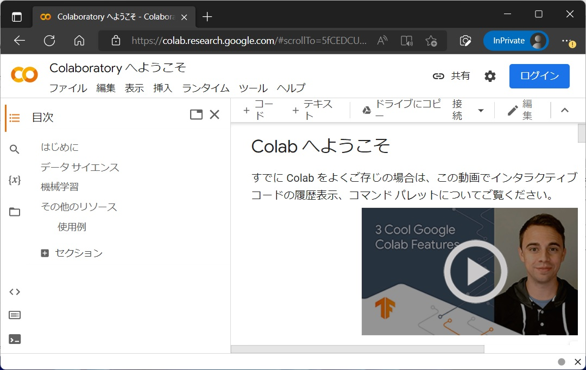

# 文理融合データサイエンスIIA この講義について

- [文理融合データサイエンスIIA この講義について](#文理融合データサイエンスiia-この講義について)
- [1. シラバス](#1-シラバス)
  - [1.1 内容](#11-内容)
  - [1.2 到達目標](#12-到達目標)
  - [1.3. 教室外の学習方法](#13-教室外の学習方法)
  - [1.4. テキスト](#14-テキスト)
  - [1.5. 参考書等](#15-参考書等)
  - [1.6. 成績評価方法](#16-成績評価方法)
  - [1.7. 学生へのフィードバック](#17-学生へのフィードバック)
  - [1.8 成績評価基準](#18-成績評価基準)
  - [注意!! 必ずパソコン持ってきてください](#注意-必ずパソコン持ってきてください)
- [2. 講師略歴](#2-講師略歴)
- [3. 講義の進め方](#3-講義の進め方)
  - [3.1. 方針](#31-方針)
- [4. 講義資料、レポート提出](#4-講義資料レポート提出)
  - [講義資料](#講義資料)
  - [4.A.1. GitHub を知らない人のための説明。](#4a1-github-を知らない人のための説明)
- [5. Google Colab](#5-google-colab)
  - [5.2 Google Colab の特徴](#52-google-colab-の特徴)
  - [5.3 Google Colab の起動](#53-google-colab-の起動)
  - [6 講義の位置づけ](#6-講義の位置づけ)

# 1. シラバス
## 1.1 内容
文理融合データサイエンスIに続き、データサイエンスの手法を学ぶ．
文化現象を対象にデータサイエンスの手法を用いた事例を概観し、
文理融合型の研究におけるデータ分析の有効性と重要性を学ぶ。
本授業では、データサイエンスの基礎を直感的に理解できる内容をめざしながら、
卒業研究の際に必要になってくるデータサイエンスの実践力を習得する。
なお本講義は開講初年度なので、
受講者と試行錯誤を行いながら講義内容を発展させていく予定である。

## 1.2 到達目標
（1）データサイエンスの全体像を理解する
（2）データサイエンスの主要な手法について、目的、手法、結果の意味を理解する。
（3）データサイエンスの実際の処理、結果の妥当性の確認を行える。

## 1.3. 教室外の学習方法
・実習用プログラムを提示する。
授業時間以外に、情報実習室や情報処理教室、
自宅のコンピュータ等で、
予習・復習を進めること。
・授業中に課される課題を実施すること。

## 1.4. テキスト
配布資料を用いる。
授業ではBYOD[自分のパソコンを持参して操作する]とするので持参すること。(支障ある場合は相談すること)。

## 1.5. 参考書等
最新のもので推奨できるものを第1回目の講義であらためて紹介する。
下記は授業の内容と一致するものではないが関連して参考となるものをあげる。
1)今西航平他、データサイエンスがどういうものかを予習的に理解するのに向く
2) 図解ポケット 今日から使える！ データサイエンスがよくわかる本、秀和システム
3) gacco/jmooc 「AI・データサイエンス基礎」
AI, データサイエンスの基礎を動画でざっくり見ることができる
https://www.jmooc.jp/ai-and-datascience/

## 1.6. 成績評価方法
定期試験　行わない
授業内試験　0%
期末レポート　00%
平常点3100%
その他、授業期間内小テストや実習レポート(70%)を考慮する。

## 1.7. 学生へのフィードバック
- 授業期間中に小テストを課し、次回授業時に講評を行う。(In-class quiz with feedback in next class) [Y]
- WebClassを利用してフィードバックを行う。(Feedback on WebClass use)

## 1.8 成績評価基準
1. データサイエンスの全体像と目的を理解したか
2. データサイエンスの個々の手法について、目的、手法、結果の意味を理解したか。
3. データサイエンスの実際の処理、結果の解釈を行えるようになったか。

## 注意!! 必ずパソコン持ってきてください

- 授業ではBYOD[自分のパソコンを持参して操作する]とするので持参すること。(支障ある場合は相談すること)。
- google account も利用可能としておいてください。
- 動作確認をしておくこと(第3回くらいからでよいです)

# 2. 講師略歴

- 関心はないと思いますが、金子の研究分野や業績を知りたい場合

  金子格 resesarchmap.jp マイポータル
  https://researchmap.jp/read0208088

- 金子の雑談が読みたい場合

  金子のfaecbook page

  https://www.facebook.com/itaru.kaneko.3

- 金子の書いた本が買いたい場合

  https://www.google.com/search?tbm=bks&q=%E9%87%91%E5%AD%90%E6%A0%BC

# 3. 講義の進め方

## 3.1. 方針

1. 学生が求める教育を効率的に
2. 講義(説明) はできるだけ、録画、ネット配布で。
3. 演習は google colab で

   google colab だと再現性が高いです。けっこう性能もよいです。
   ただし、google アカウントでトラブルがあったり、google のデータセンターや通信障害があると使えなくなりますから、ローカルを使いたい人は使ってかまいません。
4. レポートは常時大量に受け付ける。(全部見られないかもしれませんが一応割と多読です)
5. 評価は作業報告を中心に。

# 4. 講義資料、レポート提出

## 講義資料

GitHub 公開しますので、アクセスしてください。

[講義資料のリンク(GitHub)]( https://github.com/ItaruKaneko/lecture_twuc_ds1/tree/master/md "link" )

## 4.A.1. GitHub を知らない人のための説明。

GitHub(ギットハブ)は、広く使われている情報共有ツールの一つです。
仕事で情報共有する場合、SNSより便利な機能がいろいろあります。

1. 講義資料の編集、バージョン管理、通知が可能です。
2. 講義資料は常時アップデートされます。
3. 登録しておくと、アップデート通知が送信されます。
4. みなさんが修正することも自由です。

だれがどんな修正をしたかがすべて記録されます。

# 5. Google Colab

## 5.2 Google Colab の特徴

Google Colab は google 社が提供するクラウド型のソフトウエア開発環境です。

[利点]

クラウド上でWebブラウザを通して、プログラムの編集、実行が行えます。
プログラムの実行は Google 社のデータセンターのサーバで行われるので、
個人のパソコンの性能と関係なく、高性能の計算リソースが利用できます。

[欠点]

クラウドサービスなので、インターネット接続がないと動作しません。

## 5.3 Google Colab の起動

https://colab.research.google.com/

このような webpage が開きます。

(2022/9/16 現在、サービスの内容は時期によって変わることがあります)

Google Colab を利用するには以下2つの準備が必要です。

1. Google Account
2. ブラウザ
3. 設定を Python から R 言語に変更する

大学で提供している Google Account を用意してください

ログオンやR言語設定のその方法は以下を参照してください。

[Google Colab の準備]( ../reference/r_reference.md )

## 6 講義の位置づけ

[データサイエンス副専攻] (https://www.twcu.ac.jp/main/topics/2021/r08ji80000001qy1-img/datascienceoverview2.png)

[数理・データサイエンス・ＡＩ教育プログラム認定制度（リテラシーレベル）] (https://www.mext.go.jp/a_menu/koutou/suuri_datascience_ai/00002.htm)

背景

データサイエンスI 第1回では、以下のような解説があったのではないかと思う.

以下の3つの要因から多くの職場でデータサイエンスのリテラシーが重要になってきた。

1. DX によるデータ駆動型社会への移行
2. IoT、インターネット、クラウドによるデータの取得利用の拡大
3. 第3次AIブームとデータサイエンスブームをもたらした、技術革新による圧倒的な性能向上

データと分析、学習によって可能なものであれば、昨日まで不可能と思われていたことがどんどん可能になっている。

例: 

1.音声の認識や合成

2.翻訳

3.顔や物体の認識

農家や漁師さんもデータサイエンスを駆使する時代となっている。

そのため、ほぼすべての大学でのAIデータサイエンス教育の強化が進んでいる。

データサイエンスは数値を分析することが目的ではなく、
それぞれの職務の中でデータを活用して、効果をあげることが目的なのだ。

ナイチンゲールはよく例としてあげられる。
(この話はすでに聴いたことがある人は多いと思いますが)

名前は知っているが、何をやったかは意外に知られていない。

彼女は根気よく、膨大な治療成績を系統的に収集した。
そのなかで、感染の原因を追及していった。
やがて、感染が換気と相関が高いことを見出し、
当時の常識に反して病室の換気を改善し、
院内感染を減少させることに成功した。

ナイチンゲールはデータサイエンスの創始者とされている.

[Florence Nightingale: The Lady Behind the lamp] (https://www.historyofdatascience.com/florence-nightingale-the-lady-behind-the-lamp/)

今日、コンピュータ技術によりナイチンゲールのように自ら根気よく集めなくても、データは機械の力ですでに集まっている。そこで、そのデータから真実を見出し、正しい判断をする能力が、現代人の素養としては必要になっている。