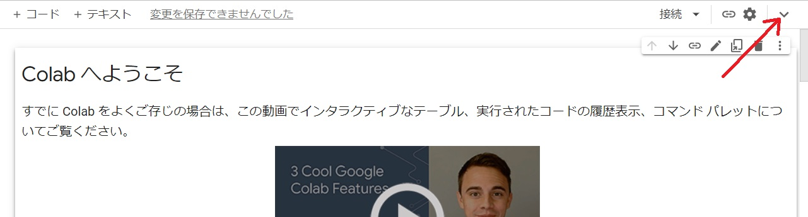
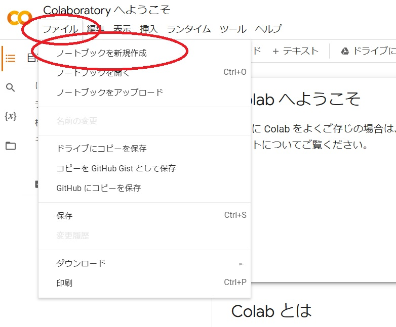
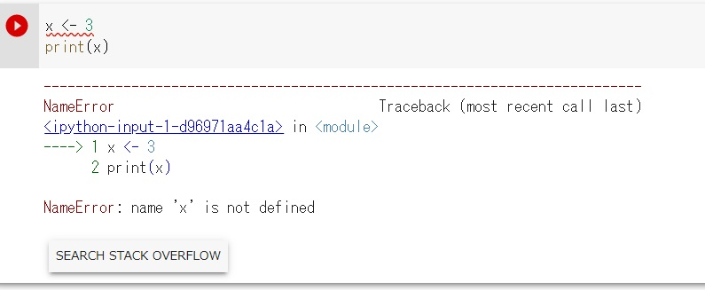
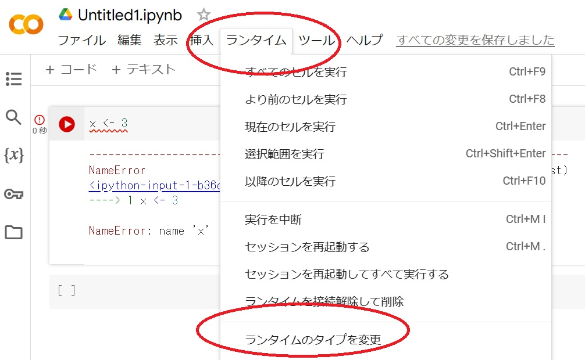
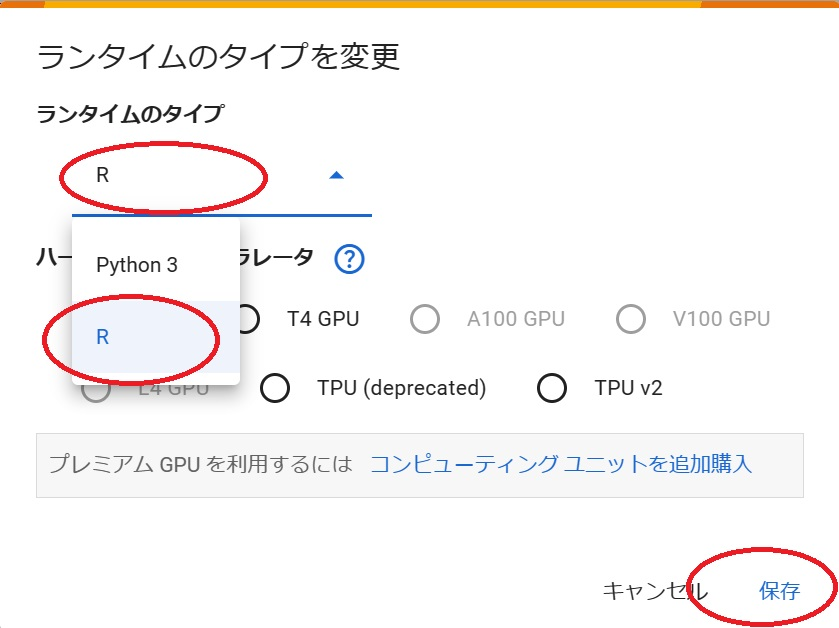
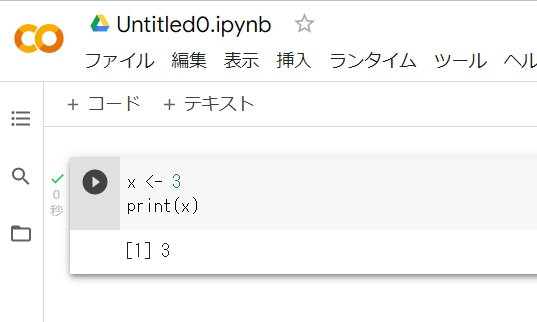
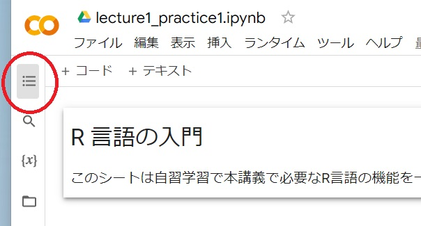
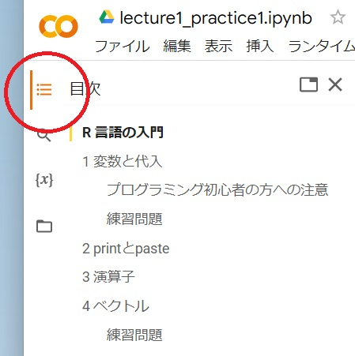

# GoogleColab の準備

- [GoogleColab の準備](#googlecolab-の準備)
  - [1. あらかじめ用意するもの](#1-あらかじめ用意するもの)
  - [2. ログイン](#2-ログイン)
  - [3. R言語に設定](#3-r言語に設定)
    - [3.1. ノートブックを作成する](#31-ノートブックを作成する)
    - [3.2. ノートブックをダウンロードする](#32-ノートブックをダウンロードする)
    - [3.3. ダウンロードしたノートブックを開く](#33-ダウンロードしたノートブックを開く)
    - [3.4. ダウンロードしたノートブックの編集](#34-ダウンロードしたノートブックの編集)
    - [3.5. 結果をアップロード](#35-結果をアップロード)
  - [3.6 動作の確認](#36-動作の確認)
- [4 サンプルコードの実行](#4-サンプルコードの実行)

## 1. あらかじめ用意するもの

1. Google account
2. Web ブラウザ (キーボードが使えるものが望ましいがタブレットでも可能)
3. Windowsとword (でなくてもよいのですが、ファイルをダウンロードしてエディタで編集する必要があります)
4. インターネット接続

## 2. ログイン

以下のリンクをクリッして、
Gogle Colabolatory を別ウインドウで開く

このような webpage が開きます。

(2022/9/16 現在、サービスの内容は時期によって変わることがあります)

右上の「ログイン」をクリックし、google account でログインします。

## 3. R言語に設定

Google colab では通常 Pythion 言語が選択されているもで、これを R 言語に変更します。

### 3.1. ノートブックを作成する

右上のこの部分で Web ページ上部のメニューを開きます。

ファイル/ノートブックを新規作成

を選びます。

Untitled0.ipynb というファイルがつくられます。(もしかするとUntitled?.ipynb と?の部分の数字はかわるかも)

ここで、コード、を入力します。

~~~
x <- 3
print(x)
~~~

と入力します。
ここでセルの左にある「▷」は実行ボタンで、これをクリックするとプログムを実行します。
しかしここで「▷」実行ボタンをクリックすると、以下のようにエラーが出るはずです。

これは Google colab は通常 Python 言語を処理するようになっていて、このプログラムは Python 言語としては
誤っているからです。

そこで、この後ノートブックを Python を実行する設定から、R 言語を実行する設定に変更します。
まちがえないようよく注意し操作してください。

### 3.2. ランタイムのタイプを変える

ランタイム

メニューを開き

ランタイムのタイプを変える

を選びます。

ランタイムのタイプを変更

のポップアップが表示されるので、

ランタイムのタイプ

をクリックして、選択枝の中から

R

を選んで

保存

をクリックします。

もう一度 R 言語が実行できるかどうかを確認します。

## 3.3 動作の確認

動作を確認しましょう。

コード

をクリックすると新しいセル(入力できる枠)ができますからここに R 言語の命令を入力します。

て以下のコードを入力しましょう。

~~~
x <- 3
print(x)
~~~

コードを入力したらセルの左側の実行ボタン(右 ▷ ) をクリックすると R 言語として入力した命令が実行されて、結果がセルの下にあらわれます。

もし画面のようにセルの下の「3」が表示されれば、R言語が正常に動作しています。

もしも以下のようにエラーが出たら、Python 言語のままになっていますので、この操作をやりなおしてください。

# 4 サンプルコードの実行

google drive にサンプルファイルをアップロードしておきます。
practice1.ipynb をダブルクリックすると、google colab を起動できます。
R言語の設定はすでにされています。

以下のように、左上の目次のアイコンをクリックすると、目次が開きます。

目次が表示されたところ

