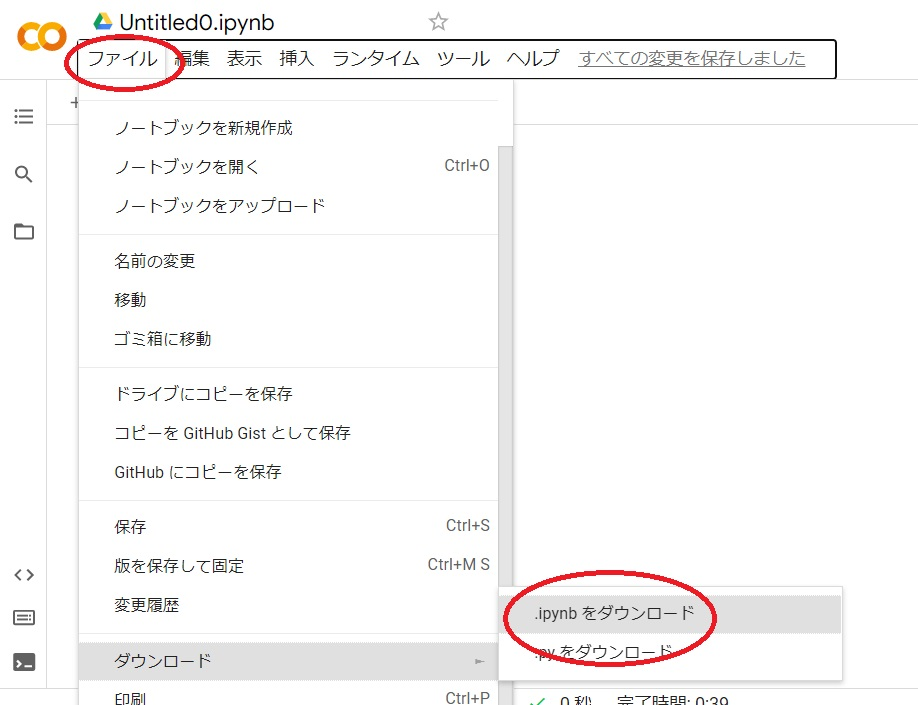
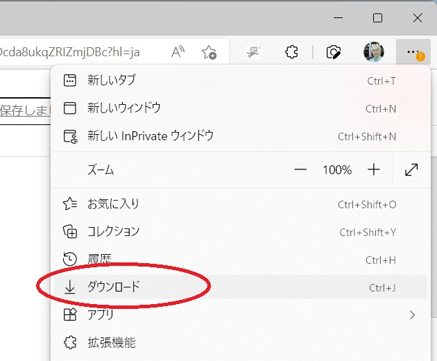
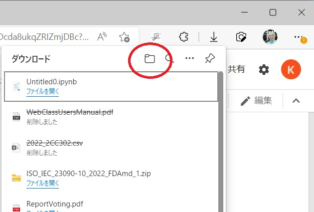
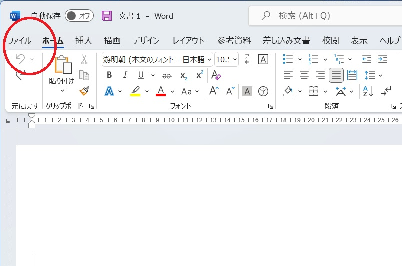
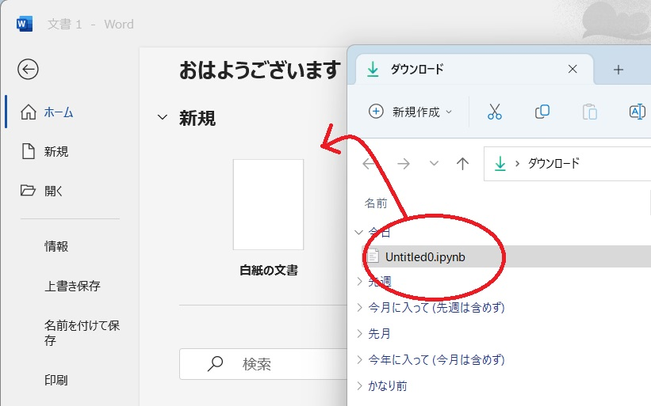
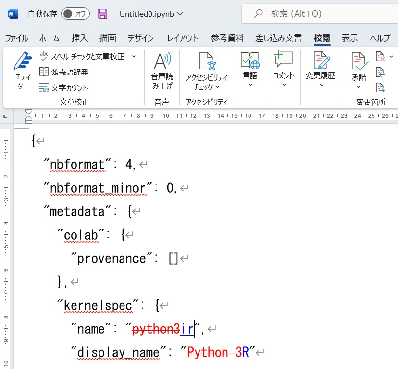
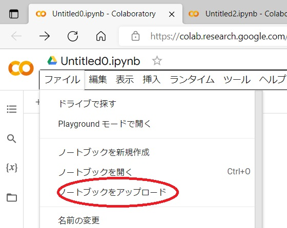
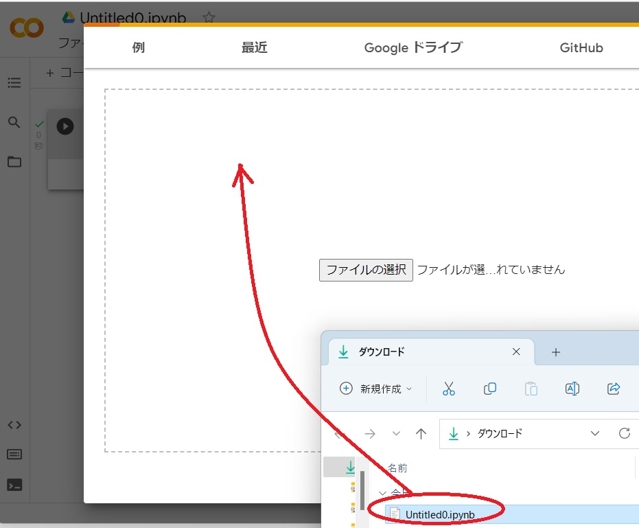

# GoogleColab の準備

## あらかじめ必要なもの

1. Google account
2. Web ブラウザ (キーボードが使えるものが望ましいがタブレットでも可能)
3. Windowsとword (でなくてもよいのですが、ファイルをダウンロードしてエディタで編集する必要があります)
4. インターネット接続

## ログイン

https://colab.research.google.com/

このような webpage が開きます。

(2022/9/16 現在、サービスの内容は時期によって変わることがあります)

右上の「ログイン」をクリックし、google account でログインします。

## R言語に設定

Google colab では通常 Pythion 言語が選択されているもで、これを R 言語に変更します。

### 1. ノートブックを作成する

右上のこの部分で Web ページ上部のメニューを開きます。

ファイル/ノートブックを新規作成

を選びます。

Untitled0.ipynb というファイルがつくられます。(もしかするとUntitled?.ipynb と?の部分の数字はかわるかも)

ここで、コード、を入力します。

~~~
x <- 3
print(x)
~~~

と入力し、実行ボタン「▷」をクリックすると、以下のようにエラーが出るはずです。
これはPython 言語が動作しているからです。

### 2. ノートブックをダウンロードする

ファイル/ダウンロード/ipynbをダウンロードします。

ブラウザのメニューでダウンロードを選びます。
ここでは Windowsと Edge の場合で説明していますが他OSではそのOSの方法に読み替えてください。

また、ここからしばらくはダウンロードしたUntitld0.ipynb を編集するだけなので、もし編集方法を知っていればこの先に飛ばして結構です。

### 3. ダウンロードしたノートブックを開く

ダウンロード先のフォルダを開きます。

Word を開いてファイルメニューを開きます。

Untitled0.ipynb をドラッグすると、Untitled0.ipynb を Word で開くことができます。

### 4. ダウンロードしたノートブックの編集

Untitled0.ipynb を編集します。
変更箇所は2箇所。

|変更前   | 変更後 |
|:--      |:--    |
| python3 | ir    |
| Python3 | R     |

と変更するだけです。

以下は編集の様子で、編集箇所がわかりやすいように word の変更履歴を表示していますが、変更履歴を表示する必要はありません。赤字が削除する部分で、青字の部分を入力してください。

### 5. 結果をアップロード

変更したファイルをアップロードします。

Googlecolabの画面で

ノートブックをアップロード

を選び、ダウンロードしたファイルのフォルダからドラッグします。

Google colabを更新すると画面の様子はかわりませんが、ノートブックが更新されています。

ここで、

コード

をクリックして画面のようなコードを実行しましょう。

~~~
x <- 3
print(x)
~~~

と入力し、実行ボタン(右 ▷ ) をクリックします。

もし画面のように「3」が表示されれば、R言語が正常に動作しています。

もしも以下のようにエラーが出たら、Python 言語のままになっていますので、この操作をやりなおしてください。

