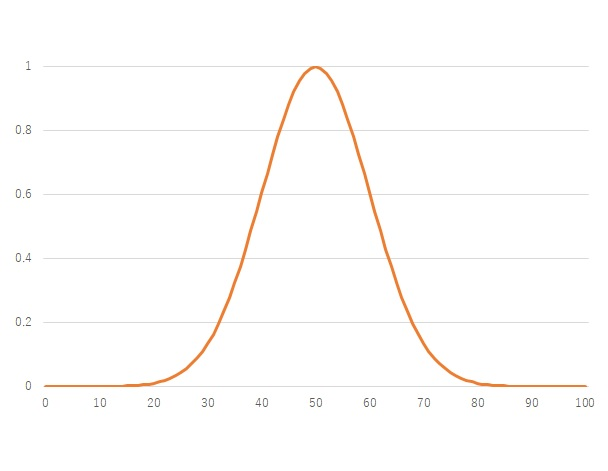
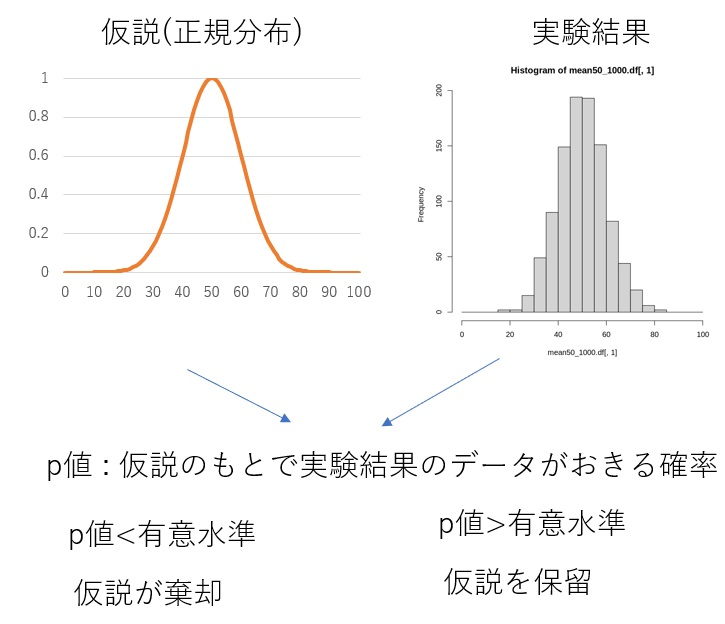
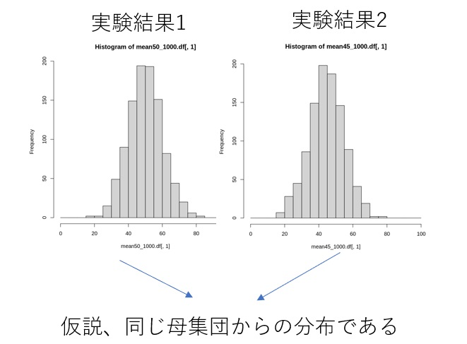

# 確率統計の理解
この資料では、確率・統計の主な用語を解説します。

この資料は、確率・統計の教科書ではありません。学術的な正確さは目指しませんので、理論としての確率・統計を
学びたい場合は、確率・統計の教科書で学んでください。

この資料では、データサイエンスの講義で必要となる確率・統計の理解のために、
最小限の理解を得ることを目指します。
## 1 確率

確率とは何でしょう。
サイコロを振ったとき1が出る確率は1/6とすることが多いですね。なぜでしょう。

これはサイコロのどの目が出る確率も等しい、と仮定するからです。
2が出る確率も3が出る確率もどの目が出る確率も同じ1/6です。
そしてn通りの事が等しい確率で起こるのであればその確率は1/nとなるはずです。

コインの裏表が等しい確率であるならば、それぞれ起きる確率は1/2ですね。

それでは サイコロの目が等しい確率で出るということはどうしてわかるのでしょうか。

これは経験によってそう信じているわけです。しかし本当に表裏の確率が等しいとは限らないですね。
サイコロの目が1/6の確率で起こるということもわからないわけです。
もしかしたらコインは歪んでいて表が出やすいかしれないし、サイコロも歪んでいるかもしれません。

そこで、どうすれば実際にこれらの確率が1/2であったり1/6であるかを確かめられるか、という問題が生じます。

## 2 確率に関する仮説と検証

科学とは検証です。科学的主張は検証可能なものでなければならず、科学的主張は仮説をいかに検証したか、という主張でなければなりません。これは物理、化学、統計学でも同様です。

そこで、確率についての仮説をたてる場合にも仮説をたてて検証し、仮説が正しいかどうかを検証します。

まず目の前の現象がどのような確率で起こるかを仮定します。これが確率に関する仮説です。 その仮説が正しいかどうか、これを検証しますが、そのために実験をしたりデータを検証したりすればよいわけです。

確率の議論では、確率についての仮説をたてて、その仮説が正しいかどうかを検証する、という道筋にそって主張が行われます。この主張の道筋を、しっかりと理解し、それに慣れる必要があります。

まず簡単な例を説明してみます。
コインを10回投げ、コインの表と裏が1/2の確率で出る、ということを主張するとします。 そこで、この主張が正しいかどうか、実際にコインをなげて試してみることにしましょう。

1回目表が出ました。 さて、表裏の確率は1/2という仮説は信じられますか？皆さんどう思いますか？一回ではわかりませんよね。
もう一度投げてみましょう。

また表が出ました。さて、表裏は1/2の確率でしょうか。どうもそうではないと思う人が増えてきたかもしれません。でも1/2の確率でも2回続けて表が出ることもないわけではない。ですからまだ、仮説が間違っていると強く主張する人は少ないでしょう。

ではもう一回投げましょう。

3回目も表が出ました。さて今度はどうでしょう。いや非常に運が悪かっただけでやはり3回連続表が出ることだって絶対ないとは言えません。でも相当自信はなくなってきました。

どんどん投げます。

10回続けて表が出ました。
こんなことはそれほどしょっちゅうはおきません。
しかし、もしこういう結果が得られたら、あるいはこういうデータがあれば、これで1/2の確率だと信じ続けるのはかなり困難ですね。こんなことはありえない！と思います。

これが確率に関する仮説の正しさを検証する、基本的な方法です。
つまりある確率で物事が起こると仮定する。 そして実験をしたりデータを入手したりします。そしてその結果がおこりやすいかどうかを検討し、仮説の正しさを評価するのです。

しかし、このような実験やデータによって、仮説が100%あっているか、間違っているか、といえるかというと、それは確定しません。

10回表が出たコインをしらべてみると、

「なーんだ、やっぱりこのコイン、両側表じゃないか！」という可能性は高いです。

しかし、

「あれ？どこにもおかしなところはないな。さらに実験を続けよう。あ、以後は表と裏はランダムに出るようだ。やはり最初の10回は偶然だったのだ。」

ということもあり得ます。

実験や、データの分析は、あくまで仮説のもっともらしさを評価するだけで、断定はできないのです。

つまり、確率や統計に基づいて、実験結果やデータを分析する場合、まず仮説のもとに、得られたデータがおきる確率を計算します。
もしそれがほとんど起きないようなことであれば仮定がうたがわしい、 つまり最初に仮定した確率が違うに違いない、と結論するわけです。

逆に観測されたことが十分起こりえることであれば仮説は肯定されたことになります。

それでは上にあげた例の確率を計算してみましょう。
コインの表と裏が1/2の確率で出ると仮定し、表が10回連続で出る確率を求めると、それは2のマイナス10乗つまり1/1024になりますね。コインの表裏の確率が1/2であるなら、1/1024の確率でしか起こらないことがおこった、ということになります。それはあまりに珍しいから、仮定である1/2の確率がおかしい、と考えるわけです。
## 3 対立仮説、帰無仮説

さてこのような検証の仕方をするわけですが、この検証の方法の論理をより厳密に表すために特別な用語を使います。
それを使って同じことを説明していきましょう。

まずコインのオモテウラの確率が1/2でない可能性があるか検証したいわけです。
この時1/2ではないという仮説を対立仮説と呼びます。

そしてこれを検証するためには後でそれがありえないということを説明する仮説を立てるわけですがこの場合はコインの表と裏が1/2の確率であるという仮説になります。そしてこの仮説はあとで否定しますので帰無仮説.ややわかりにくい方ですが無に帰す仮説ということで帰無仮説と呼びます。
そして帰無仮説のもとで、観測結果やデータが起こりえる確率をもとめ、それが妥当であるかということで、仮説の妥当性を判断するわけです。
星コインが10回表になったら、帰無仮説が正しいとすれば、それが起こる確率は1/1024となりますね。帰無仮説が正しければ観測されたことは非常に小さい確率でしか起こり得ないだから、仮説はうたがわしい、と結論付けるわけです。
しかし、ここで「仮説が正しい確率」を求めているわけではありません。仮説が正しいとしたときに、観測結果やデータが起こりえる確率を求めているのだ、ということにも注意してください。それによって間接的に、仮説の正しさを判断しているわけです。

ここでは確率と対立仮説帰無仮説の意味とそれらの使い方について説明しましたまずこれをしっかりと理解してください。

## 4 有意水準、P値

さて確率と対立仮説と帰無仮説お造り帰無仮説によって起こり得ないようなことが起こった時に帰無仮説が否定されるということがわかりました。それではこのほとんどありえないというのはどのように表せばいいでしょう。確率的な事象は、でたらめにおきますから、どんなに実験をくりかえしたりデータを集めても、仮説が100%ただしいとか、100%間違いである、とは主張できない、ということはわかりますね。

そこで、非常に小さな確率を指定して、その非常に小さな確率よりも小さい確率の事が起きれば、殆どありえないことが起きたから否定する。もしそれより大きければ、仮定によっておきるべきことがおきたから、仮定を肯定する、という評価のしかたをします。

この小さな確率というのはもしそれによって非常に確実に仮説を否定したいのであれば非常に小さな確率である必要があるし、まあまあありえないだろうという程度で良ければ多少大きな確率でもいいわけです。

原発が事故をおこさない、ということのためなら、おこりえない事象は非常に小さな確率にしておかなければいけませんね。でも大学生の皆さんが、研究の結果を分析するのなら、20回に一回程度間違えても、たいしたことはない。

そこで、このように帰無仮説を否定する基準とする確率を「有意水準」、意味がある水準という言葉であらわします。難しい言葉ですが、要するに確率です。もし有意水準より稀なことが起きればそれは意味がある、という意味です。

従って有意水準は小さいほど厳密に検証することになります。例えば有意水準5%で帰無仮説が否定されるとは、帰無仮説が正しいなら5%以下の確率でしかおきないことがおきた。有意水準1%でなら、同じく1%の確率でしかおきないことがおきた。ということになります。
そしてこの実際におきた、あるいはデータに含まれていた事象の確率をP値と言います。

もし表が出る確率が1/2である、という仮説が帰無仮説仮説であり、
コインの表が10回連続して出たとします。
すると、その確率は1/1024なので、P値は 1/1024 = 0.00097 となり、
有意水準0.1%未満で帰無仮説は否定されたことになります。

## 5 なぜこういう用語を理解する必要があるのか?

ここでは有意水準、P値、そして帰無仮説の関係について説明しました。P値がxxだから有意水準xxで帰無仮説が否定された、という言い回しはこれからよく使うので、よく理解しておいてください。

帰無仮説、有意水準、p値というのは、ようするに、仮説のもっともらしさをあらわす表現方法にすぎません。
ですから一般にはたとえば、「ワクチンによって感染が防げる確率は95%です」というような説明がなされます。
ならそのような簡単な表現をつかった方が簡単でよいのでは、と思うかもしれません。

しかし、ここまでの議論を注意深くたどった人は、実際にはどのような実験を行ったとしても、xxがおこる確率がyy%である、
というような結論は得にくいのだ、ということがわかると思います。

特に実験データが少ない場合、たとえば100人程度で結果を得た場合には、xxxがおこる確率がyyy%だった、
という表現は誤解をまねくうえ、精密な表現とは言えません。

ですから、データサイエンスのツールでは、結果のもっともらしさを表すのに、p値や、有意水準、帰無仮説という表現を
よくつかい、これらの用語の正確な意味を理解している必要があるわけです。
# 6 t 検定

確率についての仮説の検証はまず確率に関するモデルを作りそれに基づいて実験結果やデータがどれだけの確率で発生する顔計算で求め仮説が正しいかどうかを検証するということがわかりました。それではこれを使ってどうやって実験結果から確率モデルを求めることができるでしょうか。

さっきの例のように表と裏が1/2の確率で出るかどうかという問題は数回テストしただけでは全くわからないということが理解できると思います。これはあまり有益な推測ではありませんし役に立ちそうにもありません。

そこでもう少し役立つ確率的なモデルの例として正規分布になるかどうかという検定を考えてみます。正規分布は中学でも習うので説明は省きますがだいたいこのような分布ですね。

そして正規分布を仮定すればその仮定のもとで実験結果のようなばらつきのあるデータが得られるかどうかは同じように計算をすることができるわけです。従ってある平均値と分散持った正規分布を仮定すれば実験結果あるいは与えられたデータがその分布である、という帰無仮説を立てることができます。

そしてこの帰無仮説に基づいて、有意水準を設定してp値を求めて、仮説の検証すればいいわけです。もしp値が有意水準より十分小さければ、帰無仮説が否定され実験結果やデータはそのような正規分布ではほぼ起こりえない、と結論付けることができます。

同様に多少条件が異なるいくつかの検定があり目的によって使い分けます。ここではよく使う t 検定というものを説明しましょう。

t 検定ではある実験結果やデータが別の実験かやデータと同じ母集団から得た結果である、という仮説を帰無仮説として、確率を求めます。

R 

~~~
t.test(x=data1,y=data2,var.equal=T,paired=F)
~~~

するとこんな結果が得られます。

~~~
	Two Sample t-test

data:  mean50_1000.df[, 1] and mean45_1000.df[, 1]
t = 12.18, df = 1996, p-value < 2.2e-16
alternative hypothesis: true difference in means is not equal to 0
95 percent confidence interval:
 4.619189 6.392158
sample estimates:
mean of x mean of y 
 50.08618  44.58051 
~~~

ここで p-value というのがp値、つまり帰無仮説である「二つのデータが同じ母集団のデータである」という仮説が正しい場合にこの結果が得られる確率で、2.2e-16 ですから 1京分の2.2である。ほとんどありえない。という結論になります。

このように t 検定で二つの実験結果やデータに分布の差があるかどうかということが確率的に判定できるわけです。

ただし、繰り返しになりますが求める確率は「二つの分布が同じ母集団である確率とか同じ母集団ではない確率」ではないということに注意してください。求めているのはあくまで二つの分布が同じ母集団である場合に、こうしたデータが得られる確率です。

言い回しが微妙に違うだけなので、ややこしいかもしれませんね。しかし場合によってはこの違いが非常に重要な意味を持ちます。もしできれば、この違いは正確に理解しておくと良いでしょう。

ちょっとだけ補足すると、先のコイントスの場合を考えてもらうと、コインの表と裏が出る確率というのは誰も知ることができないわけです。たとえ10000回コイントスをしたとしても表と裏が出る順序はもしかしたらあらかじめ決まっていたのかもしれませんし本当にランダムかもしれません。それは実験によっては分からないことなのです。我々が知ることができるのは代わりにコインの表と裏が1/2の確率で出ると仮定すれば我々が知る限りの実験結果やデータを非常に高い角度で予測ができるということだけなのです。ですから平均値を検定する場合もこの平均値がこの値である確率という問いかけはしないで平均値と分散がこの値であればこの実験結果が得られる確率が何々であるという計算をして結果の妥当性そして仮説の妥当性を判断していくわけです。

## 7 $\sigma$ (シグマ) と95%信頼区間

95%信頼区間あるいは 2 $\sigma$、4 $\sigma$ 、6 $\sigma$ という表現を見ることがあります。これは正規分布が既知であると仮定した場合の確率についての表現です。

これらの表現は、本当は分からないはずの真の確率分布を前提にしていますので注意が必要です。これについては後で補足します。

真の確率分布がぴったり正規分布だとすると、平均値からの変位で確率が決まりますね。そのとき、平均値からの差が標準偏差の1倍以内である確率は約70%になります(厳密に計算すると68.27%です)。

標準偏差を$\sigma$ (シグマ)と呼び、その1倍、2倍4倍といった範囲はよく使われます。平均値との差が $\sigma$ の何倍以内であるか、とその確率は以下のようになります。

|           範囲           | 確率  |
|:------------------------:|:-----:|
|  - $\sigma$  $\cdots$ $\sigma$  | 68.27% |
|  -2 $\sigma$ $\cdots$ 2 $\sigma$  | 95.45% |
|  -4 $\sigma$ $\cdots$ 4 $\sigma$  | 99.73% |
|  -6 $\sigma$ $\cdots$ 6 $\sigma$  | 99.9997% |

例えば体重計の測定誤差の標準偏差が10グラムだとしましょう。この時誤差10グラム以内、つまり1σの範囲には約70%のサンプルが含まれます。誤差20グラム以内、2 $\sigma$ には約95%が含まれます。

そこで、2 $\sigma$ の範囲を約95%信頼区間とも呼びます。ピッタリ95%ではないことに注意しましょう。また、プラス方向に2 $\sigma$ 以上の誤差がある場合は約2.5%、マイナス方向の場合も約2.5%あることになります。

6 $\sigma$ の範囲には99.9997%が収まりますが、10億個以上の部品を集積したコンピュータの部品品の信頼性としてはやや不足しますね。さらに信頼性を高めるために8 $\sigma$ 、10 $\sigma$ を採用することもあります。

最初にのべたように、この確率の推定方法は、確率が正確に正規分布であることが前提です。そう確信できる場合もありますが、複雑な機械の動作を正規分布とみなすのは危険でしょう。

たとえば自動車の寿命なとを正規分布を当てはめて、ある寿命以下で故障する確率を求めるのは妥当な推定方法とはいえません。