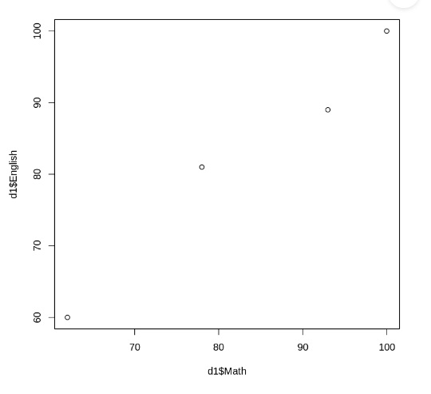
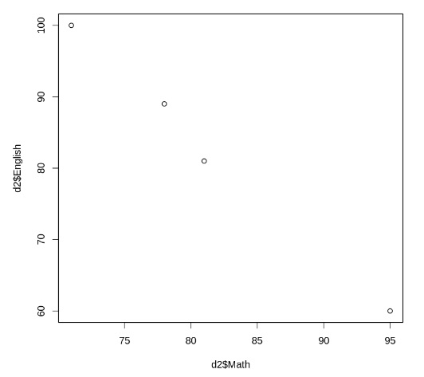
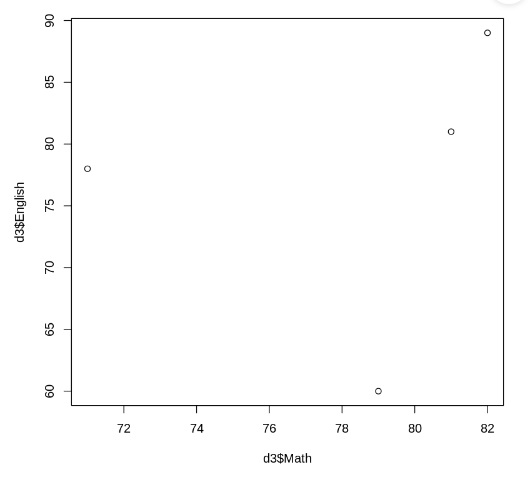
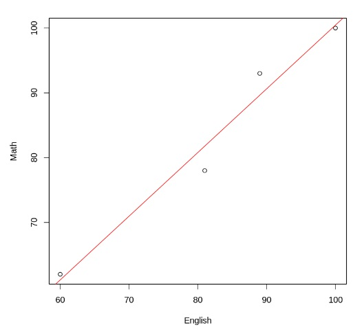

## 1 相関係数

あるクラスで 数学の試験と 英語の試験の成績のデータを集めたとします。
どのような関係がありえるでしょうか?

数学の成績が良い人は英語の成績もいい、という傾向があるかもしれません。

|  番号  |  数学   | 英語  |
|:------:|:------:|:------:|
|  1  |  93   | 89  |
|  2  |  78   | 81  |
|  3  |  100   | 100  |
|  4  |  62   | 60  |

あるいは逆に数学の成績が良い人は英語の成績の方は悪い、という傾向があるかもしれません。

|  番号  |  数学   | 英語  |
|:------:|:------:|:------:|
|  1  |  78   | 89  |
|  2  |  71   | 100  |
|  3  |  81   | 81  |
|  4  |  95   | 60  |

傾向は顕著かもしれないし、ほとんどわからない程度の傾向かもしれません。
あるいは数学の成績と英語の成績には全く関係がないかもしれません。

|  番号  |  数学   | 英語  |
|:------:|:------:|:------:|
|  1  |  82   | 89  |
|  2  |  71   | 78  |
|  3  |  81   | 81  |
|  4  |  79   | 60  |

これを数値的に表現するのが相関係数です。

数学の点数と英語の点数が完全な比例関係にあるならば 相関係数は1になります。反比例の関係にあるならば-1になります。 無関係であればゼロになります。
そして R 言語では相関係数はデータを与えるば簡単に求めることができます。

しかし、二つの変数の関係を一つの相関係数であらわすことは妥当でしょうか?
どういう場合ならそれが妥当だといえるでしょうか?

そのようなことを理解するため、単回帰、線形回帰、相関係数を順番に理解していきましょう。

## 2 線形単回帰分析

回帰分析の求め方を知らなくても R 言語のライブラリを使えば簡単に求めることができます。
回帰分析を利用するために、計算方法は必ずしも知っている必要はありません。

しかし、原理を理解しておくことでより どういう場合に回帰分析をつかって
適切にデータを処理することができます。

まず単回帰について説明しましょう。

単回帰とは、2変数のデータを一次式で近似することです。

一次関数というのは直線ですね。つまり、適当に直線を引いてみてどのような直線が一番データに近いかを求めればいいことになります。

このような直線を求めるの簡単で まず全てのデータと一次関数との誤差を計算し その誤差を一次関数の係数の 関数とするような関数を考えます。 一次関数の係数を与えるとデータとの誤差を計算するというような関数がえられるわけです。

この関数を係数によって微分します 。 するとその微分された関数は 係数を変化させたときにどれだけ誤差が増減するかということを表しているわけです。

誤差が最小になるところではこの微分値はゼロになるはずですね。 ですからこの微分値をゼロにするという方程式を解くことによって 誤差を最小にするような 一次関数の係数を求めることができます。

計算を振り返ってみると 一次関数の係数を決め そこから近似誤差を求め その近似誤差から 筋肉さんの微分お求め 微分値をゼロにすることによって元に戻って一次関数の係数を求めるので、 元に戻るという意味で回帰分析と呼びます。

回帰分析の計算方法がわかっていれば どのようなことが分かるでしょうか。 回帰分析では 一次関数とデータの誤差を最小化するだけですから データの順番は全く影響を与えません。 

## 3 最小二乗法

回帰分析ではどの直線が一番データに近いか、という指標が必要ですが、それは直線との誤差が少ないものをよい近似であるとして最もデータに近い直線を求めます。

1つのデータとの誤差は、データを通る直線であれば最小となりますが、3点以上の点であれば、すべての点を通る直線を求めることはできないので、どうやって誤差の合計を最小とするか、ということが問題になりますね。

このとき、線形単回帰分析では、全てのデータと直線の距離を求めて その距離の二乗和が 最も小さい直線を、誤差が最小の直線とします。

これを最小二乗法と呼ぶわけです。

誤差の二乗和を最小にするのはいくつもの利点があります。

線形代数を使うと、誤差の差の二乗は、全データがあらわすベクトルと、直線が表すベクトルとの「距離」になるので、これを最小とする直線は一意的に決まります。またそのような直線は線形代数の計算で簡単に求めることができます。Rのライブラリもそうして、直線を求めています。

そして、誤差の二乗を最小にするような回帰式は相関係数から簡単に求めることが可能です。

## 4 線形回帰分析をやってみる

線形回帰分析用いる lm は linear model の意味
cars というデータフレームを用いる。
cars に含まれるdist と speed の回帰分析を行う

~~~~
x1 <- c(93,78,100,62)
y1 <- c(89,81,100,60)
d1 <- data.frame(No = seq(1,4,1), Math=x1, English = y1)
model1 <- lm(Math ~ English, data = d1)
summary(model1)
~~~~

以下のような結果が得られます。

~~~~
Call:
lm(formula = Math ~ English, data = d1)

Residuals:
      1       2       3       4 
 3.3600 -3.7754 -0.4539  0.8693 

Coefficients:
            Estimate Std. Error t value Pr(>|t|)  
(Intercept)   2.1459    10.4193   0.206   0.8559  
English       0.9831     0.1244   7.906   0.0156 *
---
Signif. codes:  0 ‘***’ 0.001 ‘**’ 0.01 ‘*’ 0.05 ‘.’ 0.1 ‘ ’ 1

Residual standard error: 3.64 on 2 degrees of freedom
Multiple R-squared:  0.969,	Adjusted R-squared:  0.9535 
F-statistic:  62.5 on 1 and 2 DF,  p-value: 0.01563
~~~~

## 5 回帰分析に関係する用語

### (1) 共分散

共分散は二つの変数の値をまず平均からの誤差で表しその積を足し合わせたものになります。

共分散が重要なのは、線形回帰分析の場合は、回帰直線の式が共分散から直接求まるからです。

回帰分析の中でも変数の関係が線形である場合は特別にごく簡単に変数の関係を求めることができます。

共分散で変位の積が正なら正の相関、負なら負の相関になり、0に近ければ無相関になります。
このことを知っていると、データを見ただけで、ある程度相関係数を見積もることができるわけです。

### (2) 重回帰分析

変数が2以上の回帰分析を重回帰分析といいます。
線形回帰分析であれば、重回帰分析も比較的簡単に求められます。

### (3) 説明変数、目的変数

回帰分析をするとある変数を別の変数で説明できるということになります。例えば所得と大学時代の成績に相関があった場合俺は大学時代の成績によって所得がある程度説明できるということになるので、これを因果関係と考えれば所成績で所得をどの程度説明できるかということを相関係数が表してることになります。そのような場合には所得を目的変数成績を説明変数とするわけです,

### (4) 可視化
相関係数は数値で求まりますが相関係数が表す直線の方程式をデータとともにグラフで表示することによって可視化することができ.回帰分析の結果がどのデータをどの程度良くならをしているかを視覚的に確認することができます。

### (5) 散布図
またデータだけをサンプルとして表すこともできます
### (6) 正の相関
二つの変数が一方が増えるともう一方も増える傾向を持つ相関を正の相関といいます。相関係数も共分散も正の値になります。

### (7) 負の相関
二つの変数が一方が増えるともう一方が減少する傾向を持つ相関を負の相関といいます。相関係数も共分散も負の値になります。
### (8) 強い相関
二つの変数が比例関係に近く、比例関係からの差がごく小さいような場合が強い相関です。一方の値から他方の値が高い精度で推定できます。正の相関でも負の相関でも、一方から他方が高い精度で推定できれば、それは強い相関です。

### (9) 弱い相関
二つの変数が無関係に近く、一方から他方がほとんど推測できない場合が弱い相関です。弱い相関では、二つの変数は無関係に近く、相関係数も、共分散も小さな値になります。

### (10) Min
最小値 です

### (11) Max
最大値

### (12) Median

中央値。中央値は平均値ではなく、サンプルを大きさの順にならべたときに、ちょうど順序で中央, 9サンプルなら5番目にあたるサンプルです。サンプルが偶数の場合は、中央の2サンプルの平均が中央値になります。

### (13) Mean
平均値

### (14) 回帰式
回帰分析の結果をあらわす式です。
一般には回帰分析は複雑な数値計算が必要ですが、線形回帰では簡単な回帰式であらわせます。

回帰式は以下のようにしてプロットできます。
~~~
plot(Math ~ English, data = d1)
abline(model1, col="red")
~~~

## 6 回帰分析の帰無仮説

さて回帰分析も確率的な予測ですから、厳密にはモデルと帰無仮説があるわけです。

回帰分析の帰無仮説は回帰係数の値を仮定して行われます。
t分布とp値を使って検定されます。

たとえば、x, y の単回帰で y が x に相関があるかないかを検定するのであれば、

回帰係数を $\beta$ として、

- 帰無仮説 $\beta$ = 0

- 対立仮説 $\beta$ $\ne$ 0

として検定を行い、p値を計算して、有意水準を下回れば
帰無仮説を棄却、つまり x と y には関係がある、とします。
## 7 予測

データが時系列の場合は回帰分析の結果を時間の関数として解釈して未来の時点における値を推測することに使うことができます。
一方で予測に使う場合には、通常は回帰直線を推定するのではなく未来の予測値の方を汚水てく推定するようにモデルを作って回忌計算をするのが普通です,

## 8 過剰適合と AIC

### 8.1 過剰適合, オーバーフィッティング

回帰分析ではオーバーフィッティングという問題にも注意しなければなりません。オーバーフィッティングというのは文字通り過剰に適合してしまうという意味です。どういうことでしょう。例えば体重と身長の関係を分析するとします。10人の体重と身長を分析すると傾向が見えてきますね。しかし身長から推測される体重には若干の誤差があります。
これに誕生日や血液型を説明変数として増やすと予測精度がはるかに上がるという現象が生じます。しかしこれは、たまたまそのデータにおいて誕生日や血液型と見かけの相関によるものであることは明らかですね。

一般に説明変数を多く摂りすぎるとこのようにたまたま現れた相関を使って本来の伊豆であるものまで説明してしまうので過剰に結果を精度よく表す回帰分析の結果が得られてしまいますこれをオーバーフィッティングと呼ぶのですね。

オーバーフィッティングを避けるためにはデータの説明変数は合理的な範囲にとどめておく必要があります。また多くの変数をを記録しておくとその変数のいくつかを選ぶことによってたまたま得られた良い結果を本当の相関と誤認してしまう可能性もありますから、実験や調査を計画する時にはあまりに過剰な説明変数を無計画に用意するということは避けるべきです。

### 8.2 尤度関数

$B = b$である場合にAがおこる確率を条件付き確率

$P(A|B = b)$

をもとに、Aが観察されたときに変数bの関数としたものを尤度関数という。

$L(b | A) = \alpha P(A|B = b)$

A がおきたことがどれだけもっともらしいか、という関数。

### 8.3 AIC

AIC(Akaike's Information Criterion) は下記の式であらわされます。

$AIC =-2 \ln L+2k$

$L$ は尤度、kは自由度です。

自由度が少ないほど、尤度が大きいほどAICは小さくなります。

自由度を増やせば尤度を大きくできますがAICは大きくなります。また自由度が少なすぎても尤度が小さくなることでAICは大きくなります。このバランスがとれてAICが最小になった比率が、過度な自由度ではなく、尤度を高めたモデルであり、これが適切なモデルの基準であるとされています。

もちろんこれはバランスの問題で、AICが最小であるからオーバーフィッティングがない、とは限りません。たとえば、たまたまデータがモデルに適合していた場合にはAIC最小でもオーバーフィッティングが生じているかもしれません。

小さいほど、よいモデルであるとされます。

過剰適合がおきていないかを判断する指標であり、AIC 以外にも BIC (Baysian Information Criterion) など様々な基準があります。

## 9 新たなデータによる検証

得られた結果をの報告を見ただけでは、多くの異なる説明変数の組み合わせから、たまたま良いものを選んだり、オーバーフィッティングしたものであるかは、区別がつきません。

回帰分析の結果が疑わしい場合、全く新たに取得した実験結果やデータで、再度検証してみるとどうなるでしょうか？

オーバーフィッティングや、過剰な説明変数によって得られた、過度に良い結果は、このような追加で行った実験では消失します。

ですから、疑わしい結果を検証するためには、新たなデータを追加するということが有力な検証方法になります。