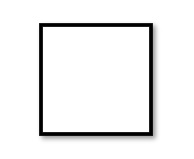
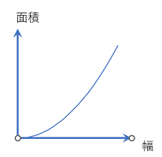
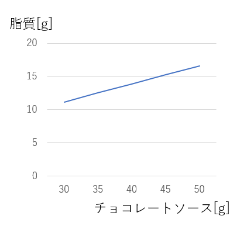

# 主成分分析とちょっと変わった線形代数の説明
# 1 はじめに
主成分分析はもっとも広く使われている分析方法の一つです。

主成分分析を勉強するためにはどうしても避けて通れないことがあります。それは線形代数です。
線形代数は多くの分析でも重要です。しかし主成分分析では、特に線形代数を理解している必要性があります。
そこでまずちょっと変わった線形代数の説明をします。

この部分は線形代数をよく知っている人には必要はありません。
飛ばしてしまっても結構です。

面白いと思ったら適当に斜め読みしていただければ十分です。

# 2 線形代数の特徴

これからはじめる説明はちょっと変わった線形代数の説明です。

線形代数をすでによくわかっている、という方は、ここを飛ばしてしまってかまいません。また普通の線形代数の説明の方がよい、という人は図書館で適当な参考書を選んで勉強してください。

線形代数の通常の説明では線形代数において重要な役割を果たす関係式や計算方法を丁寧に説明していくものが多いです。しかしそれですと、いったい何のためにその計算方法や関係式を学んでいるのかが、なかなかピンときませんね。それだと頭に入らない、という人も多いと思います。
そこで、これから始める説明では、「なにがうれしいか」ということを重点的に説明しながら線形代数を説明していこうと思います。ですから線形代数の重要な関係式や計算方法についてはそれほど詳しく説明しません。それらは普通の線形代数の教科書で学ぶことができるでしょう。

これから、以下の順番で説明していきましょう。

- 何が線形なのか？
- 何で線形だとうれしいのか？
- 線形代数でなにが扱えるのか？
- 線形代数で何がわかるのか？
- どうしてそんなにもてはやされるのか？
- 自分は線形代数を何に使えばよいのか？

## 2.2 何が線形なのか？
線はわかりますね。線と面は違います。また直線と曲線も違いますね。
では線形代数では何が線形なんでしょう？

たとえば、これはどちらが線形でしょうか?

どちらだと思いますか?

これは正方形です。

図1 正方形

正方形は直線でできています。
正方形の高さと面積の関係はこんな感じ。

図2 二次関数

正方形の高さと面積は二次関数です。
この関係は、線形ではない、直線的な関係ではないわけです。
するとこの関係は線形代数では扱えないのです。

ではこれはどうでしょう。

図3
チョコレートパフェ

これは線形代数で扱えるものです。

チョコレートパフェはアイスクリーム、チョコレートソース、コーンフレーク、生クリームでできています。

それぞれの重量を表にすることができます。

表1 チョコレートパフェの材料配分
|  材料         | 分量        |
| :------------ | ----------: |
| アイスクリーム |   80g       |
| チョコレートソース |   40g       |
| コーフレーク   |   25g       |
| 生クリーム     |    60g      |

そして各材料の栄養素、エネルギー、タンパク質、脂質、炭水化物
は以下のように表で表すことができます。

表2 100g あたりの栄養素
|  材料             | エネルギー |タンパク質| 脂質 | 炭水化物|
| :--------------- | ----- | ----: | ----: | -------: |
| アイスクリーム     | 180 | 3.90  | 8.0 | 22.85 |
| チョコレートソース | 390  | 4.9  | 27.2 | 29.0 |
| コーフレーク       | 380  | 7.8  | 1.7  | 83.6 |
| 生クリーム         | 432  |  2.0  |  45.0 |  3.1 |

材料配分をベクトル $x$ であらわして、各材料の栄養素を行列 $A$
であらわすことにすれば、チョコレートパフェの栄養価は、

$y = A x$

で表されます。

このようにチョコレートパフェの材料の比率と、エネルギー、タンパク質、脂質、炭水化物
の関係式は、完全に線形の式で表されます。

たとえばあるチョコレートパフェのチョコレートソースを増減すると、脂質の変化はこうなります。

図4 チョコと脂質

チョコレートを増やすほど甘くなりますが、その関係式は直線です。

線形代数というのはこのように、入力となるすべての変数と、算出されるすべての変数の関係が一次関数、直線になるような関係式を扱う代数学なのです。

$x$ と $y$ の関係が線形であるとはこのような式であらわされることを意味します。

$y = Ax + b$

これは、$x$ のどの要素と $y$ のどの要素の関係をグラフにしても直線になるということを意味します。
逆に、もし入力となる変数と出力となる変数の関係がすべて線形であれば、この式で関係式があらわされ、それは線形である、ということです。これで線形とはどんなことかわかりました。

## 2.3 線形だとどうしてうれしいのでしょう?

$y = Ax + b$

この式はとても計算がしやすいのです。

たとえば、 $y$ の方がわかっていて $x$ を逆算したいときは

$x = A^{-1} (y - b)$

で計算できます。また  $y$  と $x$ がわかっていて $A$ , $b$ を求めたい場合、
十分な数の $x$ ,  $y$  がわかっていれば求められます。

線形代数では、簡単に短時間で計算できることが非常に多い。
ということが線形代数が便利な大きな理由です。

実際の問題でどんなことが計算できるかは後で見ていきます。

## 2.4 線形代数でなにが扱えるのか？

どのようなものが線形代数で扱えるのでしょう。

少し考えてみると、世の中にぴったり線形のものはほぼ何もありません。
先にあげたチョコレートパフェは、だいたい線形であるとみなされます。

しかしステーキの焼き時間とおいしさはどうでしょう。
生ではおいしくない。少しやくとおいしくなりますが、焼きすぎるとこげてしまっておいしくない。非線形です。
勉強する時間と幸福はどうでしょう。まったく勉強しないと不幸になりそうです。では勉強はすればするほどよいかというとあまりやりすぎると頭がおかしくなってしまうかもしれません。これも非線形。
給与と幸福、目のおおきさとかわいさ、天井の高さと快適さ、すべて線形ではない。

じゃぁあまり線形代数が使える対象はないのだろうか。

しかし完全に線形でなくても、線形代数が意外に役立つ理由があります。

- なにかを少しだけ変化させた場合、そしてその統計的な効果は ある範囲で線形とみなせる場合が多い。

例えばステーキを焼きすぎればおいしくなくなります。しかし焼き加減を少しだけかえて、「おいしい」と思ってもらったお客さんの統計を取ると、それは一定の率であがっていくと予想されます。

変化が少しで、統計的に結果を見れば、線形の関係であることが多いのです。

ですからすでにあるていどうまくいっている物事について、さらにそれをベストな状態に調整していくときには線形代数は大変役立つ、というわけです。

## 2. 5 なにがうれしいか

線形代数は非線形な関係を近似してしまうのですから誤差が生じるのではないかと思われます。このような関係式を使って計算を行うとなぜメリットがあるのでしょう。

重要な理由の一つに、コンピュータという装置が線形代数の計算に向いているという背景があります。

計算機ではどんな問題でも簡単に解けるわけではありません。

例えば非線形の微分方程式の解を求める効率の良い方法は存在しません。

しかし線形代数の問題の解法は昔から非常に効率の良いアルゴリズムが見つかっています。早くから線形代数の問題は、計算機でよく解かれるようになり、そのことが応用範囲を広げ、また計算機も線形代数の計算を効率よく実行できるように進歩しています。

ベクトル型計算機という呼び名を聞いたことがありませんか?

このベクトルは線形代数のベクトルと厳密に同じでありませんが、ベクトル型プロセッサーは線形代数の問題を解くのに非常に適しています。

また少し高いパソコンには GPU というオプションがついていますが、これもベクトル計算や線形代数の計算を高速に行う能力を持っています。

なのでもし解決しなければならない問題をなんとか線形代数の問題にすることができると、その問題は非常に効率よく解くことができるというわけです。

# 3 線形代数の基礎的理解

## 3.1 多次元空間

しかし、もし $x$ と $y$ が正の係数の比例関係であれば $x$ が増加すれば $y$ が増えるのはあたりまえで数学を使うまでもなく自明です。ではどのような場合に線形代数は威力を発揮するか。それは次元が非常に多い場合です。

ベクトルというものを覚えていると思います。

$y = Ax + b$

この式の  $x$  も  $y$  もベクトルであるわけですつまり  $x$  も $y$ も例えば100個の変数であり、Aは非常に大きな行列であったりします。

たとえばword2vec というツールはよく使われますが、これは単語をベクトル化します。単語をベクトル化する、というと難しく思えますが、単語の意味一つ一つを一つの次元とするだけです。

~~~~
重い = [ 1, 0, 0]
広い = [ 0, 1, 0]
白い = [ 0, 0, 1]
軽い = [-1, 0, 0]
狭い = [ 0,-1, 0]
黒い = [ 0, 0,-1]
~~~~

とすれば、白い重い石と、黒い軽い石は似ていないが、白い重い石はそれよりは似ていると計算できます。
また大きいは、重い、広いと、小さいは、軽い、狭いという意味が若干含まれますから、それを反映して、

~~~~
大きい = [ 1/2, 1/2,0]
小さい = [-1/2,-1,2,0]
~~~~

と表すのです。

参考 : 
https://ja.wikipedia.org/wiki/Word2vec

## 3.2 座標変換

2次元の線形空間、つまり平面の中で、座標変換というものが考えられます。
これは行列の掛け算であらわせるわけです。

逆に100次元のベクトルと行列の積も、座標変換の一種と考えられますね。ですから線形代数ではこれを線形変換と呼ぶわけです。また $x$ と $y$ を線形空間と呼ぶわけです。
また変換のことを「写像」とも呼ぶことを覚えていると思います。変換と写像はほぼ同じ意味です。

この時、行列によっては
回転、拡大縮小、それ以外
の変換が可能です。
回転と拡大縮小だけを行う写像を

## 3.3 等角写像

と呼ぶのでした。角度が変わらないからです。行列が一定の条件を見たすときに等角写像になります。

また、3次元を平面に写像することも可能です。ちょうど写真にとるように、3次元の物体を2次元上の座標にしてしまうわけです。

同じことはもっと高次元のベクトルでも可能です。100次元のベクトルを33次元に落とすことも可能です。しかし一旦2次元にした図を3次元にすることが難しいように、33次元から100次元には変換できません。

## 3.4 固有値,固有ベクトル

$Ax = \lambda x$

となるようなベクトル $x$ を固有ベクトル、$\lambda$ を固有値といいます。

といってもイメージがわきにくいのが固有値、固有ベクトルです。
こういうベクトルや値はどうやって求めるのか。
そして何の役に立つのでしょう。

はて、これはいったいどんなベクトルなんでしょう。あるベクトルに行列をかけた結果がそのベクトルに $\lambda$ をかけたものになる。つまり同じ方向のベクトルになる、ということですね。

行列が与えられたときどうやってこのようなベクトルを探すか、わかりやすい例で考えてみましょう。

2次元であれば、(0,0)を中心に半径1の円を描くことができますね。始点が(0,0)で終点を(1,0)から初めてこの円を一周したとします。そして行列を乗算した結果のベクトルも考えてみます。

元のベクトルが円上を回転していくと、行列を乗算した結果、つまり写像も、回転していきますがこの二つが重なるポイントがあることがわかります。

このポイントが固有ベクトルであり、このときの写像の長さが固有値になります。

固有ベクトルは、常に実空間にみつかるとは限りません。たとえば図形を90度回転させる写像であれば、写像は永遠に重ならない。だから計算すると固有ベクトルは複素数の値、つまり実空間では固有ベクトルがみつからないということになります。

次元が2次元以上になると、2次元のようにぐるっとベクトルを回転させて探すことはできません。しかし固有値と固有ベクトルはベクトルをくまなく探さなくても、計算で求めることができるので大丈夫です。

$Ax = \lambda x$

となるような固有ベクトルを $N$ 次元なら最大 $N$ 個見つけることが可能です。

## 3.5 何に使われているか

線形代数は様々なことに使われます。わりと早くから使われていたのは線形計画法という方法です。これは多くの量を最適な配分とするために役立ちます。またすでに線形回帰、線形予測という方法を前の回で行いました。データの傾向を求めたり、予測をしたりする計算を素早く正確に行うことができます。
しかし今日最も使われているのは信号処理です。皆さんがwifiを使う際に、データを送受信する方法はOFDM(Orthogonal Frequency Domain Modulation)という方法を用います。これは線形代数とフーリエ変換を用いた方法で、みなさんがwifiでデータを送受信する際には毎秒10億回を超える線形代数の計算をしていることになります。
しかしこの授業では主成分分析、という計算に用います。これは先ほど学んだ「固有値」を用いた計算となります。

# 4 主成分分析

さて、そろそろ主成分分析の話に移りましょう。

## 4.1 主成分分析とは

主成分分析では、相関係数行列の固有値を分析して、固有値の大きい方から固有ベクトルを選んでいきます。これが何を意味するかというと、相関行列は、相関係数を用いてある変数の他の変数への影響をあらわしたものとなります。変数 $x$ と変数 $y$ の相関係数があるかぎり、変数 $x$ が変化したときに変数 $y$ も若干変化する、と期待できますね。
しかし $x$ ,  $y$ 座標のかわりに固有ベクトルの方向にデータが変化した場合、他の次元に影響があるでしょうか。相関行列を固有ベクトルにかけても係数倍にしかならない、ということは相関行列は固有ベクトルにたいしては相関係数がない、ということと同じです。ですから固有ベクトルの方向にデータが変化してもそれと直交する方向にデータが偏ることはないわけです。

こうやって、元の変数との相関の高い方から固有ベクトルを順番にとっていくと、もとの変数との相関は高いが、他の固有ベクトルとの相関が少ない座標軸を順番にとっていくことができます。
その座標軸は互いに独立(無相関)なので、それぞれなにか独立した原因をあらわしている、と考えられるわけです。

## 4.2 チョコレートパフェの主成分は

たとえば先のチョコレートパフェを例にとりましょう。様々なサイズや盛り付けのパフェを作り、その成分を10通りくらいに分析して、データをとると、成分の分布ができますね。そのデータの主成分分析をすると4つくらいの固有ベクトルがあわられるはずです。それは何かというと、以下の4つの材料の量によるというわけです。

アイスクリーム、チョコシロップ、コーンフレーク、生クリーム

材料はこの4種類しかないので、これらの比率はかわりますが、10種類の成分の比率は完全に自由にはかわらない。だから主成分分析をすれば4つの固有ベクトルがあらわれて、それによって、アイスクリーム、チョコシロップ、コーンフレーク、生クリームの量がわかるということになります。

## 4.3 主成分分析の適用対象は

主成分分析はこのように、

多くのパラメータを持つたくさんのデータがある
それにはいくつかの要因がある(重要なものはそのうちの少数である)
要因とパラメータの関係は線形である(ただし事前にどんな関係かはわからない)

場合に、要因とパラメータの関係をデータから推測するのに役立ちます。
たとえば、10問くらいのアンケートをとって1000人くらいのデータをとったが、実はアンケートをとった人は完全に自由にいろんな回答をするのではなく、3つくらいの特徴で特徴づけられて、その特徴によって回答を選んでいる、というような場合に、その3つの特徴を主成分分析で抽出できるわけです。

## 4.4 主成分分析はどういう場合にうまくいくか

これまでの説明をよく理解していれば、主成分分析は実際の社会ではどういう対象でやくだつかがわかります。

たとえば数学の得点を分析して数学の試験で正答するために、どのようなことを学習していないといけないか、ということを大量の試験データから分析することはなんとか可能なことの一つです。こうした分析をするとたとえば20個くらいの主成分が出てきます。これは数学で学ぶ項目が大きく20個あり、それぞれが影響して試験の正答率が変わる、と言う状況をあらわしています。
また、投票の傾向をいくつかの主成分であらわしたりします。

## 4.5 主成分分析がうまくいかない場合

しかしいずれも、主成分とされた要因の影響が「線形」であるということが前提になっていることは記憶しておく必要があります。最初に述べたようにほとんどの減少は線形ではありません。ある狭い範囲でデータが線形とみなせる、ということを利用して線形代数を利用した分析は行っています。
投票の傾向にしても、数学の得点にしても、サンプルとなる有権者や学生が、それぞれの要因についてちょっとだけ変化した場合、たとえばある傾向がちょっとだけ強かったり弱かったりする人がいる、という場合は線形と仮定することの問題は少ない。しかし、たとえばある政党を非常に強く支持している人と、逆に猛烈に反感を持っている人、というような分布の時は、主成分分析はあまりうまくいかない可能性が高いといえます。
またすでに学んだように統計的な信頼性を持つには一定のデータ数が必要であり、またパラメータを多くとりすぎると、それによってたまたまよい結果が得られるオーバーフィッティングの問題は主成分分析においてもおこりえます。

したがって、主成分分析を使う際にも自分のデータが本当に主成分分析を行うのに適したものかを十分検討する必要があります。

参考

[(1) チョコレートパフェ 栄養素](https://calorie.slism.jp/200644/)

[(2)【数学】固有値・固有ベクトルとは何かを可視化してみる - Qiita ](https://qiita.com/kenmatsu4/items/2a8573e3c878fc2da306)