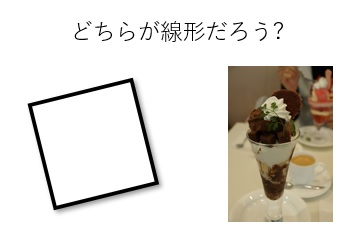

- [主成分分析とちょっと変わった線形代数の説明](#主成分分析とちょっと変わった線形代数の説明)
  - [1 はじめに](#1-はじめに)
  - [2 線形代数](#2-線形代数)
    - [2.1 ちょっと変わった線形代数の説明](#21-ちょっと変わった線形代数の説明)
    - [2.2 何が線形なのか？](#22-何が線形なのか)
    - [2.3 線形だとどうしてうれしいのでしょう?](#23-線形だとどうしてうれしいのでしょう)
    - [2.4 線形代数でなにが扱えるのか？](#24-線形代数でなにが扱えるのか)
    - [2. 5 なにがうれしいか](#2-5-なにがうれしいか)
  - [3 線形代数の基礎的理解](#3-線形代数の基礎的理解)
    - [3.1 多次元空間](#31-多次元空間)
    - [3.2 座標変換](#32-座標変換)
    - [3.3 等角写像](#33-等角写像)
    - [3.4 固有値,固有ベクトル](#34-固有値固有ベクトル)
    - [3.5 何に使われているか](#35-何に使われているか)
  - [4 主成分分析](#4-主成分分析)
    - [4.1 主成分分析とは](#41-主成分分析とは)
    - [4.2 チョコレートパフェの主成分は](#42-チョコレートパフェの主成分は)
    - [4.3 主成分分析の適用対象は](#43-主成分分析の適用対象は)
    - [4.4 主成分分析の適用対象は](#44-主成分分析の適用対象は)
    - [4.5 主成分分析はどういう場合にうまくいくか](#45-主成分分析はどういう場合にうまくいくか)
    - [4.6 主成分分析がうまくいかない場合](#46-主成分分析がうまくいかない場合)
  - [5 座標変換と主成分分析のグラフィックイメージ](#5-座標変換と主成分分析のグラフィックイメージ)
  - [6 まとめ](#6-まとめ)

# 主成分分析とちょっと変わった線形代数の説明
## 1 はじめに
主成分分析はもっとも広く使われている分析方法の一つです。

主成分分析を勉強するためにはどうしても避けて通れないことがあります。
それは線形代数です。

線形代数は多くの分析でも重要です。
しかし主成分分析では、線形代数を十分理解している必要性があります。そこで 2 と 3 ではまずちょっと変わった線形代数の説明をすることにします。

この部分は線形代数をよく知っている人には必要はありません。
読み飛ばしてしまっても結構です。

面白いと思ったら適当に斜め読みしていただければ十分です。

## 2 線形代数
### 2.1 ちょっと変わった線形代数の説明

これからはじめる説明はちょっと変わった線形代数の説明です。

線形代数をすでによくわかっている、という方は、ここを飛ばしてしまってかまいません。また普通の線形代数の説明の方がよい、という人は図書館で適当な参考書を選んで勉強してください。

なぜ変わった方法で説明するのか。

線形代数の通常の説明では線形代数において重要な役割を果たす関係式や計算方法を丁寧に説明していくものが多いです。しかしそれですと、いったい何のためにその計算方法や関係式を学んでいるのかが、なかなかピンときませんね。それだと頭に入らない、という人も多いと思います。

そこで、これから始める説明では、「なにがうれしいか」ということを重点的に説明しながら線形代数を説明していこうと思います。ですから線形代数の重要な関係式や計算方法についてはそれほど詳しく説明しません。それらは普通の線形代数の教科書で学ぶことができるでしょう。

これから、以下の順番で説明していきましょう。

- 何が線形なのか？
- 何で線形だとうれしいのか？
- 線形代数でなにが扱えるのか？
- 線形代数で何がわかるのか？
- どうしてそんなにもてはやされるのか？
- 自分は線形代数を何に使えばよいのか？

### 2.2 何が線形なのか？
線はわかりますね。線と面は違います。また直線と曲線も違いますね。
では線形代数では何が線形なんでしょう？

たとえば、以下の図をぱっとみて、あなたは左右どちらが線形だと思いますか?




「左の方が直線的だから線形?」

と思った人もいるかもしれませんが、僕は絶賛、右が線形だと感じます。

どうしてか。

これは正方形です。


図1 正方形

正方形は直線でできています。

正方形で数式を書こうと考えると、辺の長さと面積の関係を思いつきます。

それは多分こんな感じ。


図2 2次関数

これは2次関数です。

$y = x^2$

というやつですね。

この関係は、曲がっています。直線ではない。だから線形じゃない、と感じるわけです。線形とは、グラフが直線だ、ということなのです。

もちろん、この関係は線形代数では扱えません。

ではこれはどうでしょう。


図3 チョコレートパフェ

これはチョコレートパフェです。チョコレートパフェは大好きですが、これを見ると、僕は、

このパフェはコーンフレークで上げ底されているのではないか、
チョコレートシロップはたっぷり入っているだろうか、
生クリームは脂肪分が多くないだろうか、

などということが気になります。

そこでどんな材料がどれだけ入っているか、考えます。

チョコレートパフェはアイスクリーム、チョコレートソース、コーンフレーク、生クリームでできています。

それぞれの重量を表にすることができます。

表1 チョコレートパフェの材料
|  材料         | 分量        |
| :------------ | ----------: |
| アイスクリーム |   80g       |
| チョコレートソース |   40g       |
| コーフレーク   |   25g       |
| 生クリーム     |    60g      |


そして、でもダイエットには悪いよなぁ、と気になるので、各材料の栄養素、エネルギー、タンパク質、脂質、炭水化物についても考え始めます。

各材料の栄養素は、以下のように表で表すことができます。

表2 100g あたりの栄養素
|  材料      | アイス クリーム | チョコレート ソース | コーン フレーク | 生クリーム |
| :--------------- | ----: | ----: | ----: | -------: |
| エネルギー  | 180 | 390 | 380 | 432 |
| タンパク質 |  3.90 | 4.9 | 7.8 | 2.0 |
| 脂質       |  8.0| 27.2 | 1.7 | 45.0 |
| 炭水化物   | 22.85 | 29.0 | 83.6 | 3.1 |

こういう材料配分や材料の栄養疎は、ベクトル $\boldsymbol{x}$ と行列 $A$
であらわすことができます。


ここで、ベクトル、行列の要素をひとつひとつ書くとこのようになりますね。

(チョコレートパフェの材料)
```math
\boldsymbol{x} = \left[ \begin{matrix}
x_1 \\  x_2\\ x_3 \\ x_4
\end{matrix} \right] =
\left[ \begin{matrix}
アイスクリーム \\
チョコレートソース \\
コーンフレーク \\
生クリーム \\
\end{matrix} \right]
```


(チョコレートパフェの栄養素)
```math
\boldsymbol{y} = \left[ \begin{matrix}
y_1 \\  y_2\\ y_3 \\ y_4
\end{matrix} \right] =
\left[ \begin{matrix}
エネルギー \\
タンパク質 \\
脂質 \\
炭水化物
\end{matrix} \right]
```


(100g あたりの栄養素)

```math
A = \left[ \begin{matrix}
a_{1,1} & a_{1,2} & a_{1,3} & a_{1,4} \\ 
a_{2,1} & a_{2,2} & a_{2,3} & a_{2,4} \\ 
a_{3,1} & a_{3,2} & a_{3,3} & a_{3,4} \\ 
a_{4,1} & a_{4,2} & a_{4,3} & a_{4,4}
\end{matrix} 
\right] = 
\left[ \begin{matrix}
180 & 390 & 380 & 432 \\
3.90 & 4.9 & 7.8 & 2.0 \\
8.0& 27.2 & 1.7 & 45.0 \\
22.85 & 29.0 & 83.6 & 3.1 

\end{matrix}
\right]
```

すると、チョコレートパフェの栄養価は、

```math
\boldsymbol{y} = A \boldsymbol{x}
```

で表すことができますね。

念のため、これは、行列の記法を使わなければ以下であらわせる式と同じですね。

$y_1 = a_{1,1} x_1 +a_{1,2} x_2 +a_{1,3} x_3 +a_{1,4} x_4$

$y_2 = a_{2,1} x_1 +a_{2,2} x_2 +a_{2,3} x_3 +a_{2,4} x_4$

$y_3 = a_{3,1} x_1 +a_{3,2} x_2 +a_{3,3} x_3 +a_{3,4} x_4$

$y_4 = a_{4,1} x_1 +a_{4,2} x_2 +a_{4,3} x_3 +a_{4,4} x_4$


意味するところはこういう式なのだ、ということを常にイメージできることが大事です。

たとえば、あるチョコレートパフェのチョコレートソースを増減すると、脂質の変化はこうなります。


図4 チョコと脂質

このように、チョコレートを増やすほど脂質が増えますすが、その関係式は直線です。

そして、チョコレートと脂質だけではなく、生クリームとタンパク質、アイスクリームとエネルギーの関係も、直線になるわけです。

このように、入力となるすべての変数と、算出されるすべての変数の関係が一次関数、直線になるような関係式になるから、

あ、これは線形代数だ。

と思えるわけです。

そして、しつこいようですが、おなじみのこの式、

```math
\boldsymbol{y} = A \boldsymbol{x}
```

はこの式にあらわれる $x_i$ と $y_j$ はすべて一次式で関係づけられている、
$\boldsymbol{x}$ のどの要素と $\boldsymbol{y}$ をグラフにしても直線になる、
ということを表しているわけです。

逆に、もし入力となる変数と出力となる変数の関係をしらべて、
それらが常に比例関係であれば、
全体に線形の関係であり、
この式で関係式があらわされると考えられます。

これで線形とはどんなことかわかりました。

### 2.3 線形だとどうしてうれしいのでしょう?

```math
\boldsymbol{y} = A \boldsymbol{x}
```

この式はとても計算がしやすいのです。

たとえば、  $\boldsymbol{y}$ の方がわかっていて $\boldsymbol{x}$ を逆算したいときは

```math
\boldsymbol{x} = A^{-1} \boldsymbol{y}
```

で計算できます。

また  $\boldsymbol{x}$  と $\boldsymbol{y}$ がわかっていて $A$ , $\boldsymbol{b}$ を求めたい場合、
十分な数の $\boldsymbol{x}$ ,  $\boldsymbol{y}$  がわかっていれば、それらから、 $A$ , $\boldsymbol{b}$ を逆算することは比較的簡単です。

しかもその計算はわりと高速に行えるのです。
大勢の人数でやれば人手でもけっこうおおきな問題が解ける程度に簡単で手早く計算できる。


線形代数では、簡単に短時間で計算できることが非常に多い。
ということが線形代数が便利な大きな理由です。

実際の問題でどんなことが計算できるかは後で見ていきます。

### 2.4 線形代数でなにが扱えるのか？

どのようなものが線形代数で扱えるのでしょう。

少し考えてみると、世の中にぴったり線形のものはほぼ何もありません。
先にあげたチョコレートパフェは、だいたい線形であるとみなされます。

しかしステーキの焼き時間とおいしさはどうでしょう。
生ではおいしくない。少しやくとおいしくなりますが、焼きすぎるとこげてしまっておいしくない。非線形です。
勉強する時間と幸福はどうでしょう。まったく勉強しないと不幸になりそうです。では勉強はすればするほどよいかというとあまりやりすぎると頭がおかしくなってしまうかもしれません。これも非線形。
給与と幸福、目のおおきさとかわいさ、天井の高さと快適さ、すべて線形ではない。

じゃぁあまり線形代数が使える対象はないのだろうか。

しかし完全に線形でなくても、線形代数が意外に役立つ理由があります。

- なにかを少しだけ変化させた場合、そしてその統計的な効果は ある範囲で線形とみなせる場合が多い。

例えばステーキを焼きすぎればおいしくなくなります。しかし焼き加減を少しだけかえて、「おいしい」と思ってもらったお客さんの統計を取ると、それは一定の率であがっていくと予想されます。

変化が少しで、統計的に結果を見れば、線形の関係であることが多いのです。

ですからすでにあるていどうまくいっている物事について、さらにそれをベストな状態に調整していくときには線形代数は大変役立つ、というわけです。


### 2. 5 なにがうれしいか

線形代数は非線形な関係を近似してしまうのですから誤差が生じるのではないかと思われます。あえてこのような誤差のある関係式を使うことで何かメリットがあるのでしょうか。

メリットの一つに、コンピュータという装置が線形代数の計算に向いているという背景があります。

計算機ではどんな問題でも簡単に解けるわけではありません。

例えば非線形の微分方程式の解を求める効率の良い方法は存在しません。

しかし線形代数の問題の解法は昔から非常に効率の良いアルゴリズムが見つかっています。

早くから線形代数の問題は、規則にもとづいて機械的に解いていくことができることが知られていました。やがて計算機が登場すると、プログラムでおおきな問題でも自動的に解けるようになりました。そのことが応用範囲を広げ、広く使われるようになると、計算機もまた線形代数の計算を効率よく実行できるように改良され、進歩していったのです。

ベクトル型計算機という呼び名を聞いたことがありませんか?

このベクトルは線形代数のベクトルと厳密に同じでありませんが、ベクトル型プロセッサーは線形代数の問題を解くのに非常に適しています。

またDSP(デジタル信号処理プロセッサ)や、少し高いパソコンに付属している GPU というハードウエアも、ベクトル計算や線形代数の計算を高速に行う能力を持っています。

なのでもし解決しなければならない問題をなんとか線形代数の問題にすることができると、その問題は相当複雑な問題であっても、一瞬で解けるようになるのです。

ですから、線形代数は非常に応用範囲が広いのですが、ここではその話はほどほどにして、とりあえず主成分分析に必要な概念だけを理解するようにしましょう。


## 3 線形代数の基礎的理解

### 3.1 多次元空間

線形代数が役立つといっても一次元ではたいして面白くありません。

もし $\boldsymbol{x}$ と $\boldsymbol{y}$ が正の係数の比例関係であれば $\boldsymbol{x}$ が増加すれば $\boldsymbol{y}$ が増えるのはあたりまえで数学を使うまでもなく自明です。ではどのような場合に線形代数は威力を発揮するか。それは次元が非常に大きい場合です。

ベクトルというものを覚えていると思います。

```math
\boldsymbol{y} = A \boldsymbol{x}
```

この式の  $\boldsymbol{x}$  も  $\boldsymbol{y}$  もベクトルであるわけですつまり  $\boldsymbol{x}$  も $\boldsymbol{y}$ も例えば100個の変数であり、Aは非常に大きな行列であったりします。

たとえばword2vec というツールはよく使われますが、これは単語をベクトル化します。単語をベクトル化する、というと難しく思えますが、単語の意味一つ一つを一つの次元とするだけです。


```math
重い = \left[ \begin{matrix} 1\\ 0\\ 0 \end{matrix} \right] , 
広い = \left[ \begin{matrix} 0\\ 1\\ 0 \end{matrix} \right],
白い = \left[ \begin{matrix} 0\\ 0\\ 1 \end{matrix} \right]
```

```math
軽い = \left[ \begin{matrix} -1\\ 0\\ 0 \end{matrix} \right],
狭い = \left[ \begin{matrix} 0\\ -1\\ 0 \end{matrix} \right],
黒い = \left[ \begin{matrix} 0\\ 0\\ -1 \end{matrix} \right]
```


とすれば、白い重い石と、黒い軽い石は似ていないが、白い重い石はそれよりは似ていると計算できます。
また大きいは、重い、広いと、小さいは、軽い、狭いという意味が若干含まれますから、それを反映して、

```math
大きい = \left[ \begin{matrix} 0.5\\ 0.5\\ 0 \end{matrix} \right],
```
```math
小さい = \left[ \begin{matrix} -0.5\\ -0.5\\ 0 \end{matrix} \right],
```

と表してみる。そうすると、以下のようにだいたいうまく単語の意味を解釈できます。

| $A$ |  $B$  | $A  B$ | 似ているか? |
| :-----: |  :-----: |  :-----: |   :-----: | 
| 大きい机 |  重くて広い机 | 1.0 | 似ている |
| 白い机 |  黒い机 | -1.0 | むしろ逆 |
| 大きい机 |  黒い机 | 0.0 | 似ていない |
| 大きい机 |  広い机 | 0.5 | 少し似ている |

Word2Vec は言語処理ではとてもよく使われていて、人間が辞書を使うように文章を計算で処理するときには、とりあえず Word2Vec で単語の意味をベクトルにしてからいろいろな処理を行うわけです。

そしてもちろん Word2vec では何十万語という語彙を扱うので、ベクトルの次元もそれに近い1万次元以上の次元になります。こうした非常におおきな次元も線形代数は簡単に扱えるので、Word2vecが便利に使えることになります。


参考 : 
https://ja.wikipedia.org/wiki/Word2vec

### 3.2 座標変換

2次元の線形空間、つまり平面の中で、座標変換というものが考えられます。
これは行列の掛け算であらわせるわけです。

逆に100次元のベクトルと行列の積も、座標変換の一種と考えられますね。ですから線形代数ではこれを線形変換と呼ぶわけです。また $\boldsymbol{x}$ と $\boldsymbol{y}$ を線形空間と呼ぶわけです。
また変換のことを「写像」とも呼ぶことを覚えていると思います。変換と写像はほぼ同じ意味です。

この時、行列によっては

- 回転
- 拡大縮小
- それ以外

の変換が可能です。

線形代数で座標変換ができることをもっともよく使うのは、3Dゲームです。


これらのゲームで、様々な視点の画像を作るために、画面に合わられるすべての物体秒がに必要な膨大な座標を線形代数で変換して2次元上に写像します。そのために、ゲーム機やゲーム用PCには GPU 、グラフィックプロセッシングユニット、という機能が備わっていますが、これはとにかくものすごいスピードで線形代数の演算を使って座標を変換しています。


### 3.3 等角写像

回転と拡大縮小だけを行う写像を

等角写像

と呼ぶのでした。角度が変わらないからです。行列が一定の条件を見たすときに等角写像になります。

また、3次元を平面に写像することも可能です。ちょうど写真にとるように、3次元の物体を2次元上の座標にしてしまうわけです。

同じことはもっと高次元のベクトルでも可能です。100次元のベクトルを33次元に落とすことも可能です。しかし一旦2次元にした図を3次元にすることが難しいように、33次元から100次元には変換できません。


### 3.4 固有値,固有ベクトル

$A\boldsymbol{x} = \lambda \boldsymbol{x}$

となるようなベクトル $\boldsymbol{x}$ を固有ベクトル、 $\lambda$ を固有値といいます。

この式で $A$ は行列、$\boldsymbol{x}$ はベクトル、$\lambda$ はスカラー量です。

といってもイメージがわきにくいのが固有値、固有ベクトルです。

はて、これはいったいどんなベクトルなんでしょう。あるベクトルに行列をかけた結果がそのベクトルに $\lambda$ をかけたものになる。つまり同じ方向のベクトルになる、ということですね。

行列が与えられたときどうやってこのようなベクトルを探すか、わかりやすい例で考えてみましょう。

このようなベクトルがどのようなものであるかをわかりやすく視覚化している解説がありますので紹介しておきます。こちらを見ると、固有値、固有ベクトルと、行列が表す「写像」との関係がよくわかります。

[【数学】固有値・固有ベクトルとは何かを可視化してみる - Qiita ](https://qiita.com/kenmatsu4/items/2a8573e3c878fc2da306)

2次元は平面に相当しますから、その上に(0,0)を中心に半径1の円を描くことができますね。
始点が(0,0)から終点を(1,0)へのベクトルは長さが1で右向きのベクトルになります。
この終点を(1,0)を出発点として、半径1の円を一周したとします。ベクトルの方向が360度回転していきます。

元のベクトルが円上を回転していくと、行列を乗算した結果、つまり写像も、回転していきますがこの二つが重なるポイントがあることがわかります。

このポイントが固有ベクトルであり、このときの写像の長さが固有値になります。

固有ベクトルは、常に実空間にみつかるとは限りません。たとえば図形を90度回転させる写像であれば、元のベクトルと90度回転させたベクトルが重なることはありえない。写像は永遠に重ならない。だから計算すると固有ベクトルは複素数の値、つまり実空間では固有ベクトルがみつからないということになります。

次元が2次元以上になると、2次元のようにぐるっとベクトルを回転させて探すことはできません。しかし固有値と固有ベクトルはベクトルをくまなく探さなくても、計算で求めることができるので大丈夫です。

$Ax = \lambda x$

となるような固有ベクトルを $N$ 次元なら最大 $N$ 個見つけることが可能です。

### 3.5 何に使われているか

以上で線形代数の説明はだいたい終わりです。

この後線形代数の概念を使って、主成分分析を説明しますが、主成分分析以外にも線形代数は様々なことに使われますので、この後の説明に関係はないのですが、参考に紹介しておきましょう。

わりと早く、かれこれ60年近く前から使われていたのは線形計画法という方法です。これは多くの量を最適な配分とするために役立ちます。

またすでに線形回帰、線形予測という方法を前の回で行いました。これらは、未来の事を予測するにも利用されますが、もっと多くの場合に、「データを圧縮する」ためにも使われます。現在でも電話の通話は線形予測を使っています。

しかし今日最も使われているのは信号処理です。皆さんがwifiを使う際に、データを送受信する方法はOFDM(Orthogonal Frequency Domain Modulation)という方法を用います。これは線形代数とフーリエ変換を用いた方法で、みなさんがwifiでデータを送受信する際には毎秒10億回を超える線形代数の計算をしていることになります。

また今後飛躍的に利用が広がると予想されている人工知能では、その主要な計算が線形代数をその要素として使って構築されています。ですから、人工知能向けのプロセッサは線形代数の計算を超高速に実行できるものを用います。

ですから今後、なにかしら「数値的なデータ」を扱うとすれば、線形代数を見ないことはほとんどない、といってよいでしょう。計算自体はコンピュータやライブラリがやってくれますが、どんな計算をやっているかは理解しておくとよいでしょう。

しかしこの授業では主成分分析、という計算に用います。これは先ほど学んだ「固有値」を用いた計算となります。

## 4 主成分分析

さて、そろそろ主成分分析の話に移りましょう。

### 4.1 主成分分析とは

このようにデータのばらつきに偏りがある場合、データを少ない成分で最もよくあらわす方法を求める方法が、が主成分分析です。

具体的には、データの分散のうちもっとも分散の大きい成分から成分をとっていきます。

たとえば、図5 のような分布であれば $\boldsymbol{x}$ , $\boldsymbol{y}$ とも分散は同程度ですが、 $x + y$ の方向には分散が大きく、 $x - y$ の方向には分散が小さい分布となっています。
この場合、データは $x - y$の方向にはほとんどばらついていないので、データのばらつきは主に $x + y$ の方向にばらついている、ということが言えますね。
ですからこの場合、もし一つだけ成分をとるとしたら、 $x + y$ が主成分となります。


図5 主成分の抽出

なぜ分散が最も大きい成分がデータを最もよく表すのでしょうか。データを最もよくあらわすというのは、それ以外の成分を除去してしまった場合に元のデータとの誤差が最も少ないということですね。

それであれば分散がもっとも大きい成分であれば、残りの成分は振れ幅が小さいから、その成分をゼロとすることによる誤差は少ない、ということになる。

ですから、最も分散が大きい成分を主成分とすることで最も誤差を少なくデータをあらわせるわけです。

そのような成分を求めるには、座標軸をさまざまにとってみて、分散がもっとも大きい方向を選べばよいと考えられます。

しかしそれは、そのような探索しなくても、その相関係数行列の固有値を分析して、固有値の大きい方から固有ベクトルを選べば、簡単に数値的に最良の主成分を選ぶことができます。

これも線形代数で計算することによるマジックですね。一見面倒そうな計算が、方程式を解くようにいっぱつで求まるのです。

なぜ固有値を求めることで、最大の分散を持つ成分が求まるのでしょうか。

相関行列は、相関係数を用いてある変数の他の変数への影響をあらわしたものとなります。変数 $\boldsymbol{x}$ と変数 $\boldsymbol{y}$ の相関係数があるかぎり、変数 $\boldsymbol{x}$ が変化したときに変数 $\boldsymbol{y}$ も若干変化する、と期待できますね。

しかし $\boldsymbol{x}$ ,  $\boldsymbol{y}$ 座標のかわりに固有ベクトルの方向にデータが変化した場合、他の次元に影響があるでしょうか。相関行列を固有ベクトルにかけても係数倍にしかならない、ということは相関行列は固有ベクトルにたいしては相関係数がない、ということと同じです。ですから固有ベクトルの方向にデータが変化してもそれと直交する方向にデータが偏ることはないわけです。

こうして固有値と固有ベクトルを求めることで、主成分を求めることができる、というわけです。

その座標軸は互いに独立(無相関)なので、それぞれなにか独立した原因をあらわしている、と考えられるわけです。

### 4.2 チョコレートパフェの主成分は

たとえば先のチョコレートパフェを例にとりましょう。様々なサイズや盛り付けのパフェを作り、その成分を10通りくらいに分析して、データをとると、成分の分布ができますね。そのデータの主成分分析をすると4つくらいの固有ベクトルがあわられるはずです。それは何かというと、以下の4つの材料の量によるというわけです。

アイスクリーム、チョコシロップ、コーンフレーク、生クリーム

材料はこの4種類しかないので、これらの比率はかわりますが、10種類の成分の比率は完全に自由にはかわらない。だから主成分分析をすれば4つの固有ベクトルがあらわれて、それによって、アイスクリーム、チョコシロップ、コーンフレーク、生クリームの量がわかるということになります。


### 4.3 主成分分析の適用対象は

つまり主成分分析はなにをするかということをまとめると以下のようなことになります。

チョコレートパフェがどんな材料でできているか、まったくわからなかったとしましょう。そこで成分を分析するわけです。するとチョコレートパフェの成分は材料の比率によって代わってきます。

このデータをとると、成分は完全にランダムではなく、一定の法則にしたがってばらついていることがわかる。それによって、だいたい何種類の材料からなり、どの材料が最も変化するのか、といったことがわかってくるわけです。

このように主成分分析では、まさに、対象の「成分」がなにであるか、を知ることができます。それには大量のデータと多くの測定値があればよいわけです。

よく使われるのはアンケートの分析です。アンケートの多くの質問は、実は質問の答えではなく、回答にあらわれる回答者の特性を知りたいわけですが、多くの質問の回答を組み合わせることによって、回答者の回答の傾向をより低次元のパラメータで表すことができます。

### 4.4 主成分分析の適用対象は

たとえば国語、数学、英語のどの分野にもかかかわるような問題を100問ほど用意しておいて、その結果を主成分分析をすれば、国語、数学、英語の得点がわかる。あるいはもしかすると国語、数学、英語の得点は「主成分」ではなく、もっと試験の回答をよく表すような数個のパラメータで表すことができるかもしれません。

主成分分析はこのように、

多くのパラメータを持つたくさんのデータがある
それにはいくつかの要因がある(重要なものはそのうちの少数である)
要因とパラメータの関係は線形である(ただし事前にどんな関係かはわからない)

場合に、要因とパラメータの関係をデータから推測するのに役立ちます。
たとえば、10問くらいのアンケートをとって1000人くらいのデータをとったが、実はアンケートをとった人は完全に自由にいろんな回答をするのではなく、3つくらいの特徴で特徴づけられて、その特徴によって回答を選んでいる、というような場合に、その3つの特徴を主成分分析で抽出できるわけです。

### 4.5 主成分分析はどういう場合にうまくいくか

これまでの説明をよく理解していれば、主成分分析は実際の社会ではどういう対象でやくだつかがわかります。

たとえば数学の得点を分析して数学の試験で正答するために、どのようなことを学習していないといけないか、ということを大量の試験データから分析することはなんとか可能なことの一つです。こうした分析をするとたとえば20個くらいの主成分が出てきます。これは数学で学ぶ項目が大きく20個あり、それぞれが影響して試験の正答率が変わる、と言う状況をあらわしています。
また、投票の傾向をいくつかの主成分であらわしたりします。

### 4.6 主成分分析がうまくいかない場合

しかしいずれも、主成分とされた要因の影響が「線形」であるということが前提になっていることは記憶しておく必要があります。最初に述べたようにほとんどの減少は線形ではありません。ある狭い範囲でデータが線形とみなせる、ということを利用して線形代数を利用した分析は行っています。
投票の傾向にしても、数学の得点にしても、サンプルとなる有権者や学生が、それぞれの要因についてちょっとだけ変化した場合、たとえばある傾向がちょっとだけ強かったり弱かったりする人がいる、という場合は線形と仮定することの問題は少ない。しかし、たとえばある政党を非常に強く支持している人と、逆に猛烈に反感を持っている人、というような分布の時は、主成分分析はあまりうまくいかない可能性が高いといえます。
またすでに学んだように統計的な信頼性を持つには一定のデータ数が必要であり、またパラメータを多くとりすぎると、それによってたまたまよい結果が得られるオーバーフィッティングの問題は主成分分析においてもおこりえます。

したがって、主成分分析を使う際にも自分のデータが本当に主成分分析を行うのに適したものかを十分検討する必要があります。

## 5 座標変換と主成分分析のグラフィックイメージ

これまで線形空間やベクトルを言葉で説明してきましたが、
ちょっとわかりにくいかもしれません。
そこで、多少でもイメージできるように、
以下のようなグラフを作ってみます。

まず、3次元上にプロットした点群を表示してみます。

[3次元plot](javascript/un_probability_5_1.html)

次に5次元であるが、主成分が2つのデータを表示してみます。といっても5次元のデータは2次元には表示できません。
そこで3次元plotをつかって、任意の3次元を選んでplotできるようにしてみました。

[主成分が2つの5次元のデータ](javascript/un_probability_5_2.html)


## 6 まとめ

まず線形代数についての基礎的理解をしてもらうような説明を行い、そして主成分分析について説明しました。

もともと、分析対象となるものが線形代数で表されるようなものを扱い、それについてデータを大量に取得して、その統計的な性質から主成分を求めていく、ということをイメージできていればよいと思います。

主成分分析を行うには、したがって、

対象が線形代数で表されている

ということがまず必要です。そして

統計的な有意性を得られる程度に、データを大量に集められる

ということが必要になります。データが多すぎて困るということはありませんし、パラメータもデータの数に従って多すぎなければかなり多くても大丈夫です。また完全に線形でなくても、おおむね一様な傾向を持っているものであればある程度適用が可能です。

一方で、これまで学んできた統計的手法の制約は当然主成分分析でもあてはまります。データ数にくらべて次元が大きすぎると、主成分分析においても過適合に相当する問題が生じます。

一方、パラメータが多すぎる、という問題はありません。主成分分析ではもともとパラメータの数よりも主成分が少ない、ということが前提です。一つの主成分にたいして関係するパラメータが多数あっても、それは主成分との関係がより確実に求められることになるだけで、特に問題はありません。

非線形性の高いものは、もちろん主成分分析には向きません。また個々のアンケートの回答が2値や3値という場合は、これも主成分分析にはかかりにくいといえます。主成分分析をするのであれば、アンケートの回答はなにかしらの点数スケールのようなものを使う方が、情報量も多いし、分析の信頼性もあがるだろうと思います。

主成分分析は、相関係数や正規分布を仮定していますから、主成分分析の結果の信頼性の議論では、信頼性や尤度に関する評価の方法が使えるでしょう。それによって分析結果の尤度や信頼性の議論を行うのは有益だと思います。


参考


[(1) チョコレートパフェ 栄養素](https://calorie.slism.jp/200644/)

[(2)【数学】固有値・固有ベクトルとは何かを可視化してみる - Qiita ](https://qiita.com/kenmatsu4/items/2a8573e3c878fc2da306)